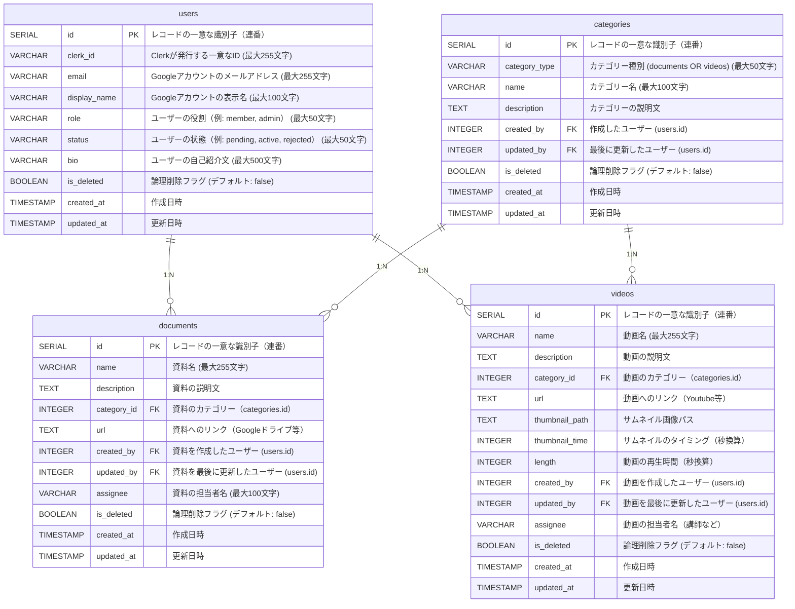

# データベース設計書

## 1. 概要

本プロジェクトでは、バックエンドサービスとしてSupabaseを採用しています。
Supabaseは、PostgreSQLを基盤としたオープンソースのバックエンドサービスです。

本プロジェクトでは以下の3種類のデータを管理します。

1. **ユーザー情報**（`users`テーブル）  
   Googleアカウント認証を活用したユーザー情報を管理します。

2. **ドキュメント情報**（`documents`テーブル）  
   資料やリンクなどのドキュメント情報を管理します。

3. **動画情報**（`videos`テーブル）  
   再生時間やリンクなどの動画情報を管理します。

4. **カテゴリー情報**（`categories`テーブル）  
   ドキュメントや動画情報のカテゴリー種別を管理します。

## 2. テーブル設計

### 2.1. users テーブル

| カラム名       | データ型       | 制約                                | 説明                                            |
| -------------- | -------------- | ----------------------------------- | ----------------------------------------------- |
| `id`           | `SERIAL`       | PRIMARY KEY                         | レコードの一意な識別子（連番）                  |
| `clerk_id`     | `VARCHAR(255)` | UNIQUE, NOT NULL                    | Clerkが発行する一意なID                         |
| `email`        | `VARCHAR(255)` | UNIQUE, NOT NULL                    | Googleアカウントのメールアドレス（最大255文字） |
| `display_name` | `VARCHAR(100)` | NOT NULL                            | Googleアカウントの表示名                        |
| `role`         | `VARCHAR(50)`  | DEFAULT 'member' NOT NULL           | ユーザーの役割（例: member, admin）             |
| `status`       | `VARCHAR(50)`  | DEFAULT 'pending' NOT NULL          | ユーザーの状態（例: pending, active, rejected） |
| `bio`          | `VARCHAR(500)` |                                     | ユーザーの自己紹介文                            |
| `is_deleted`   | `BOOLEAN`      | DEFAULT FALSE, NOT NULL             | 論理削除フラグ                                  |
| `created_at`   | `TIMESTAMP`    | DEFAULT CURRENT_TIMESTAMP, NOT NULL | 作成日時                                        |
| `updated_at`   | `TIMESTAMP`    | DEFAULT CURRENT_TIMESTAMP, NOT NULL | 更新日時                                        |

---

### 2.2. documents テーブル

| カラム名      | データ型       | 制約                                | 説明                               |
| ------------- | -------------- | ----------------------------------- | ---------------------------------- |
| `id`          | `SERIAL`       | PRIMARY KEY                         | レコードの一意な識別子（連番）     |
| `name`        | `VARCHAR(255)` | NOT NULL                            | 資料名                             |
| `description` | `TEXT`         |                                     | 資料の説明文                       |
| `category_id` | `INTEGER`      | FOREIGN KEY(categories.id), NOT NULL | 資料の分類（例: 10,11）       |
| `url`         | `TEXT`         | NOT NULL                            | 資料へのリンク（Googleドライブ等） |
| `created_by`  | `INTEGER`      | FOREIGN KEY(users.id), NOT NULL     | 資料を作成したユーザー             |
| `updated_by`  | `INTEGER`      | FOREIGN KEY(users.id), NOT NULL     | 資料を最後に更新したユーザー       |
| `assignee`    | `VARCHAR(100)` |                                     | 資料の担当者名                     |
| `is_deleted`  | `BOOLEAN`      | DEFAULT FALSE, NOT NULL             | 論理削除フラグ                     |
| `created_at`  | `TIMESTAMP`    | DEFAULT CURRENT_TIMESTAMP, NOT NULL | 作成日時                           |
| `updated_at`  | `TIMESTAMP`    | DEFAULT CURRENT_TIMESTAMP, NOT NULL | 更新日時                           |

---

### 2.3. videos テーブル

| カラム名         | データ型       | 制約                                | 説明                             |
| ---------------- | -------------- | ----------------------------------- | -------------------------------- |
| `id`             | `SERIAL`       | PRIMARY KEY                         | レコードの一意な識別子（連番）   |
| `name`           | `VARCHAR(255)` | NOT NULL                            | 動画名                           |
| `description`    | `TEXT`         |                                     | 動画の説明文                     |
| `category_id`    | `INTEGER`      | FOREIGN KEY(categories.id), NOT NULL | 動画の分類（例: 20,21）       |
| `url`            | `TEXT`         | NOT NULL                            | 動画へのリンク（Youtube等）      |
| `thumbnail_path` | `TEXT`         |                                     | サムネイル画像パス               |
| `thumbnail_time` | `INTEGER`      |                                     | サムネイルのタイミング（秒換算） |
| `length`         | `INTEGER`      |                                     | 動画の再生時間（秒換算）         |
| `created_by`     | `INTEGER`      | FOREIGN KEY(users.id), NOT NULL     | 動画を作成したユーザー           |
| `updated_by`     | `INTEGER`      | FOREIGN KEY(users.id), NOT NULL     | 動画を最後に更新したユーザー     |
| `assignee`       | `VARCHAR(100)` |                                     | 動画の担当者名（講師など）       |
| `is_deleted`     | `BOOLEAN`      | DEFAULT FALSE, NOT NULL             | 論理削除フラグ                   |
| `created_at`     | `TIMESTAMP`    | DEFAULT CURRENT_TIMESTAMP, NOT NULL | 作成日時                         |
| `updated_at`     | `TIMESTAMP`    | DEFAULT CURRENT_TIMESTAMP, NOT NULL | 更新日時                         |

### 2.4. categories テーブル

| カラム名        | データ型       | 制約                                | 説明                              |
| --------------- | -------------- | ----------------------------------- | --------------------------------- |
| `id`            | `SERIAL`       | PRIMARY KEY                         | レコードの一意な識別子（連番）    |
| `category_type` | `VARCHAR(50)`  | NOT NULL, `documents` OR `videos`   | カテゴリーの種別 |
| `name`          | `VARCHAR(100)` | NOT NULL                            | カテゴリー名 （例: 事務局資料）   |
| `description`   | `TEXT`         |                                     | カテゴリーの説明文                |
| `created_by`    | `INTEGER`      | FOREIGN KEY(users.id), NOT NULL     | 作成したユーザー                  |
| `updated_by`    | `INTEGER`      | FOREIGN KEY(users.id), NOT NULL     | 最後に更新したユーザー            |
| `is_deleted`    | `BOOLEAN`      | DEFAULT FALSE, NOT NULL             | 論理削除フラグ                    |
| `created_at`    | `TIMESTAMP`    | DEFAULT CURRENT_TIMESTAMP, NOT NULL | 作成日時                          |
| `updated_at`    | `TIMESTAMP`    | DEFAULT CURRENT_TIMESTAMP, NOT NULL | 更新日時                          |

## 3. ER図



## 4. Row Level Security（RLS）ポリシー

Supabaseでは、Row Level Security（RLS）を使用してデータアクセスを制御しています。以下に各テーブルのRLSポリシーを説明します。

### 4.1. users テーブルのRLSポリシー

#### 閲覧ポリシー（SELECT）

- `users_can_read_own_data`: ユーザーは自分自身のデータのみ閲覧可能

  - 条件: `clerk_id = get_clerk_user_id() AND is_deleted = FALSE`
  - 解説: 論理削除されていない自分自身のレコードのみ閲覧可能。

- `admins_can_read_all_users`: 管理者は全ユーザーデータを閲覧可能
  - 条件:
    ```sql
    EXISTS (
        SELECT 1 FROM users
        WHERE
        clerk_id = get_clerk_user_id()
        AND role = 'admin'
        AND status = 'active'
        AND is_deleted = FALSE
    )
    ```
  - 解説: 現在ログインしているユーザーが管理者ロール（role = 'admin'）であり、承認済み (status = 'active') かつ論理削除されていない場合に全ユーザーデータの閲覧を許可。

#### 挿入ポリシー（INSERT）

- `webhook_can_insert_users`: Clerk Webhookからの新規ユーザー登録を許可
  - 条件: `true`（実質的にサービスロールからの実行のみ許可）
  - 解説: このポリシーは主にClerkのWebhookからの登録処理用。通常のユーザーからの直接挿入は想定していない。Webhookはサービスロールを使用して実行され、RLSポリシーをバイパスする。

#### 更新ポリシー（UPDATE）

- `users_can_update_own_data`: ユーザーは自分自身の情報のみ更新可能

  - 条件1（USING）: `clerk_id = get_clerk_user_id() AND is_deleted = FALSE`
  - 条件2（WITH CHECK）: `clerk_id = get_clerk_user_id() AND is_deleted = FALSE`
  - 解説: 自分自身のデータのみ更新可能で、かつ論理削除されていない場合に限る。USINGは更新対象の行を選択する条件、WITH CHECKは更新後の値をチェックする条件を指定。ユーザーは自分のプロフィール情報などを変更できる。

- `admins_can_update_all_users`: 管理者はすべてのユーザー情報を更新可能
  - 条件:
    ```sql
    EXISTS (
        SELECT 1 FROM users
        WHERE
        clerk_id = get_clerk_user_id()
        AND role = 'admin'
        AND status = 'active'
        AND is_deleted = FALSE
    )
    ```
  - 解説: 管理者ロール（role = 'admin'）を持つユーザーは全ユーザーの情報を更新可能。管理者はユーザーのステータス変更や権限管理などを行える。

#### 削除ポリシー（DELETE/論理削除）

- `users_can_delete_own_data`: ユーザーは自分自身の論理削除のみ可能

  - 条件1（USING）: `clerk_id = get_clerk_user_id() AND is_deleted = FALSE`
  - 条件2（WITH CHECK）: `clerk_id = get_clerk_user_id() AND is_deleted = TRUE`
  - 解説: ユーザーは自分自身のデータのみ論理削除可能。実際には物理削除ではなく、`is_deleted = TRUE`に更新することで論理削除を実現。退会処理に相当する。

- `admins_can_delete_users`: 管理者はユーザーの論理削除が可能
  - 条件:
    ```sql
    EXISTS (
        SELECT 1 FROM users
        WHERE
        clerk_id = get_clerk_user_id()
        AND role = 'admin'
        AND status = 'active'
        AND is_deleted = FALSE
    )
    ```
  - 解説: 管理者ロールを持つユーザーは、他のユーザーも含めて論理削除が可能。管理者による利用停止処理などに使用される。

### 4.2. documents テーブルのRLSポリシー

#### 閲覧ポリシー（SELECT）

- `registered_users_can_read_documents`: 登録済みユーザーは全てのdocumentsを閲覧可能
  - 条件: `is_registered_user() AND status = 'active' AND is_deleted = FALSE`
  - 解説: `is_registered_user()`関数を使用して、現在ログインしているユーザーがusersテーブルに正しく登録されており、承認済み (status = 'active') かつ論理削除されていないことを確認する。この条件を満たすユーザーのみが、削除されていない全ての資料（documents）にアクセスできる。つまり、シンラボメンバーとして正規登録されたユーザーだけが資料を閲覧できる仕組み。

### 4.3. videos テーブルのRLSポリシー

#### 閲覧ポリシー（SELECT）

- `registered_users_can_read_videos`: 登録済みユーザーは全てのvideosを閲覧可能
  - 条件: `is_registered_user() AND status = 'active' AND is_deleted = FALSE`
  - 解説: documentsテーブルと同様に、`is_registered_user()`関数を使用して、ログインユーザーが正規登録されたシンラボメンバーであり、承認済み (status = 'active') かつ論理削除されていないことを確認する。この条件を満たすユーザーのみが、論理削除されていない全ての動画（videos）にアクセスできる。会員以外の一般ユーザーは動画を閲覧できない仕組みになっている。

### 4.4. categories テーブルのRLSポリシー

#### 閲覧ポリシー（SELECT）

- `registered_users_can_read_categories`: 登録済みユーザーは全てのcategoriesを閲覧可能
  - 条件: `is_registered_user() AND status = 'active' AND is_deleted = FALSE`
  - 解説: documentsテーブルと同様に、`is_registered_user()`関数を使用して、ログインユーザーが正規登録されたシンラボメンバーであり、承認済み (status = 'active') かつ論理削除されていないことを確認する。この条件を満たすユーザーのみが、論理削除されていない全てのカテゴリー（categories）にアクセスできる。会員以外の一般ユーザーは閲覧できない仕組みになっている。

## 5. サポート関数

RLSポリシーで使用される主要な関数は以下の通りです。

- `set_clerk_user_id(clerk_id TEXT)`: クライアントからClerk IDを設定するための関数
  - 定義:
    ```sql
    CREATE OR REPLACE FUNCTION set_clerk_user_id(clerk_id TEXT)
    RETURNS VOID AS $
    BEGIN
        PERFORM set_config('app.clerk_user_id', clerk_id, false);
    END;
    $ LANGUAGE plpgsql SECURITY DEFINER;
    ```
  - 解説: アプリケーションからClerk IDをデータベースセッション変数(`app.clerk_user_id`)に設定する関数。認証されたユーザーのIDを設定し、RLSポリシーでの権限チェックに使用される。`SECURITY DEFINER`はこの関数が定義者の権限で実行されることを意味し、権限昇格の仕組みとして機能する。
- `get_clerk_user_id()`: セッション変数からClerk IDを取得する関数
  - 定義:
    ```sql
    CREATE OR REPLACE FUNCTION get_clerk_user_id()
    RETURNS TEXT AS $
    BEGIN
        RETURN current_setting('app.clerk_user_id', true);
    EXCEPTION
        WHEN OTHERS THEN RETURN NULL;
    END;
    $ LANGUAGE plpgsql SECURITY DEFINER;
    ```
  - 解説: セッション変数に設定されたClerk IDを取得する関数。RLSポリシー内で現在のユーザーを識別するために使用される。`current_setting`の第二引数が`true`の場合、設定が存在しない場合はエラーではなくNULLを返す。例外処理によってエラー発生時も安全にNULLを返すようになっている。
- `is_registered_user()`: Clerk IDがusersテーブルに存在していることをチェックする関数

  - 定義:

    ```sql
    CREATE OR REPLACE FUNCTION is_registered_user()
    RETURNS BOOLEAN AS $
    DECLARE
        current_clerk_id TEXT;
    BEGIN
        current_clerk_id := get_clerk_user_id();

        IF current_clerk_id IS NULL THEN
        RETURN FALSE;
        END IF;

        RETURN EXISTS (
        SELECT 1 FROM users
        WHERE
            clerk_id = current_clerk_id
        );
    EXCEPTION
        WHEN OTHERS THEN RETURN FALSE;
    END;
    $ LANGUAGE plpgsql SECURITY DEFINER;
    ```

  - 解説: 現在のユーザーが正規登録されたメンバーであるかを確認する関数。まず`get_clerk_user_id()`で現在のClerk IDを取得し、そのIDがusersテーブルに存在することをチェックする。これにより未登録ユーザーによるアクセスを防止する。この関数はdocumentsやvideosテーブルのRLSポリシーで使用され、登録メンバーのみがコンテンツにアクセスできるようにしている。

これらの関数とRLSポリシーにより、シンラボポータルサイトでは以下のデータアクセス制御を実現しています。

- **アクセス制限**: 一般ユーザーは自分自身の情報のみ閲覧・更新可能
- **管理者特権**: 管理者は全ユーザー情報を閲覧・更新可能
- **メンバー限定コンテンツ**: 登録済みユーザーのみが資料・動画コンテンツを閲覧可能
- **データ保全**: 物理削除は禁止され、論理削除のみ許可（データの整合性保持）
- **セキュアな認証連携**: ClerkとSupabaseの連携により、セキュアな認証と権限管理を実現
