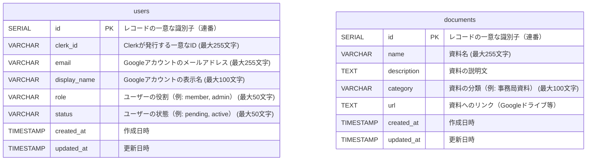

# データベース設計書

## テーブル設計

### users テーブル

| カラム名         | データ型         | 制約                             | 説明                            |
|------------------|------------------|----------------------------------|---------------------------------|
| `id`            | `SERIAL`         | PRIMARY KEY                     | レコードの一意な識別子（連番）  |
| `clerk_id`      | `VARCHAR(255)`   | UNIQUE, NOT NULL                | Clerkが発行する一意なID         |
| `email`         | `VARCHAR(255)`   | UNIQUE, NOT NULL                | Googleアカウントのメールアドレス（最大255文字） |
| `display_name`  | `VARCHAR(100)`   | NOT NULL                        | Googleアカウントの表示名        |
| `role`          | `VARCHAR(50)`    | DEFAULT 'member'                | ユーザーの役割（例: member, admin） |
| `status`        | `VARCHAR(50)`    | DEFAULT 'pending'               | ユーザーの状態（例: pending, active） |
| `created_at`    | `TIMESTAMP`      | DEFAULT CURRENT_TIMESTAMP, NOT NULL | 作成日時                   |
| `updated_at`    | `TIMESTAMP`      | DEFAULT CURRENT_TIMESTAMP, NOT NULL | 更新日時                   |

---

### documents テーブル

| カラム名         | データ型         | 制約                             | 説明                            |
|------------------|------------------|----------------------------------|---------------------------------|
| `id`            | `SERIAL`         | PRIMARY KEY                     | レコードの一意な識別子（連番）  |
| `name`          | `VARCHAR(255)`   | NOT NULL                        | 資料名                          |
| `description`   | `TEXT`           |                                  | 資料の説明文      |
| `category`      | `VARCHAR(100)`   | NOT NULL                        | 資料の分類（例: 事務局資料）     |
| `url`           | `TEXT`           | NOT NULL                        | 資料へのリンク（Googleドライブ等） |
| `created_at`    | `TIMESTAMP`      | DEFAULT CURRENT_TIMESTAMP, NOT NULL | 作成日時                   |
| `updated_at`    | `TIMESTAMP`      | DEFAULT CURRENT_TIMESTAMP, NOT NULL | 更新日時                   |

## ER図

