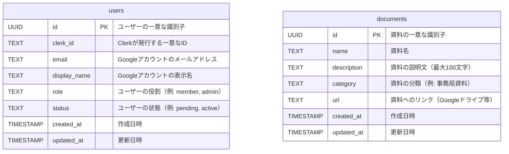

# データベース設計書

## テーブル設計

### users テーブル

| カラム名      | データ型  | 制約                             | 説明                            |
|---------------|-----------|----------------------------------|---------------------------------|
| `id`          | `UUID`    | PRIMARY KEY                     | ユーザーの一意な識別子          |
| `clerk_id`    | `TEXT`    | UNIQUE, NOT NULL                | Clerkが発行する一意なID         |
| `email`       | `TEXT`    | UNIQUE, NOT NULL                | Googleアカウントのメールアドレス |
| `display_name`| `TEXT`    | NOT NULL                        | Googleアカウントの表示名        |
| `role`        | `TEXT`    | DEFAULT 'member'                | ユーザーの役割（例: member, admin） |
| `status`      | `TEXT`    | DEFAULT 'pending'               | ユーザーの状態（例: pending, active） |
| `created_at`  | `TIMESTAMP` | DEFAULT CURRENT_TIMESTAMP, NOT NULL | 作成日時                   |
| `updated_at`  | `TIMESTAMP` | DEFAULT CURRENT_TIMESTAMP, NOT NULL | 更新日時                   |

---

### documents テーブル

| カラム名      | データ型   | 制約                             | 説明                            |
|---------------|------------|----------------------------------|---------------------------------|
| `id`          | `UUID`     | PRIMARY KEY                     | 資料の一意な識別子              |
| `name`        | `TEXT`     | NOT NULL                        | 資料名                          |
| `description` | `TEXT`     |                                  | 資料の説明文（最大100文字）      |
| `category`    | `TEXT`     | NOT NULL                        | 資料の分類（例: 事務局資料）     |
| `url`         | `TEXT`     | NOT NULL                        | 資料へのリンク（Googleドライブ等） |
| `created_at`  | `TIMESTAMP` | DEFAULT CURRENT_TIMESTAMP, NOT NULL | 作成日時                   |
| `updated_at`  | `TIMESTAMP` | DEFAULT CURRENT_TIMESTAMP, NOT NULL | 更新日時                   |

## ER図

