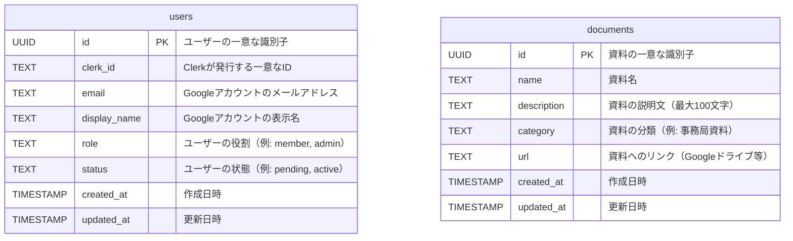

```mermaid
erDiagram
    users {
        UUID id PK "ユーザーの一意な識別子"
        TEXT clerk_id "Clerkが発行する一意なID"
        TEXT email "Googleアカウントのメールアドレス"
        TEXT display_name "Googleアカウントの表示名"
        TEXT role "ユーザーの役割（例: member, admin）"
        TEXT status "ユーザーの状態（例: pending, active）"
        TIMESTAMP created_at "作成日時"
        TIMESTAMP updated_at "更新日時"
    }

    documents {
        UUID id PK "資料の一意な識別子"
        TEXT name "資料名"
        TEXT description "資料の説明文（最大100文字）"
        TEXT category "資料の分類（例: 事務局資料）"
        TEXT url "資料へのリンク（Googleドライブ等）"
        TIMESTAMP created_at "作成日時"
        TIMESTAMP updated_at "更新日時"
    }

```
