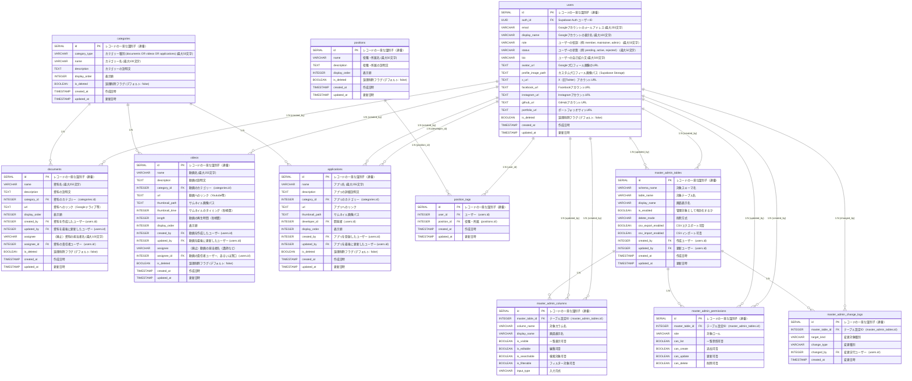

# データベース設計書

## 目次

1. [概要](#1-概要)
2. [テーブル設計](#2-テーブル設計)
3. [ER図](#3-er図)
4. [Row-Level-Security(RLS)ポリシー](#4-row-level-securityrlsポリシー)
5. [Supabase Storage](#5-supabase-storage)
6. [サポート関数・備考](#6-サポート関数備考)
7. [データアクセス制御の実現](#7-データアクセス制御の実現)

## 1. 概要

本プロジェクトでは、バックエンドサービスとしてSupabaseを採用しています。
Supabaseは、PostgreSQLを基盤としたオープンソースのバックエンドサービスです。

本プロジェクトでは以下の11種類のデータを管理します。

1. **ユーザー情報**（`users`テーブル）  
   Supabase Authと連携したユーザー情報を管理します。

2. **ドキュメント情報**（`documents`テーブル）  
   資料やリンクなどのドキュメント情報を管理します。

3. **動画情報**（`videos`テーブル）  
   再生時間やリンクなどの動画情報を管理します。

4. **カテゴリー情報**（`categories`テーブル）  
   ドキュメントや動画情報のカテゴリー種別を管理します。

5. **アプリ情報**（`applications`テーブル）  
   アプリ解説やリンクなどのアプリ情報を管理します。

6. **役職情報** (`positions`テーブル)  
   シンギュラリティ・ラボの役職・所属情報を管理します。

7. **役職タグ情報** (`position_tags`テーブル)  
   ユーザーに役職タグを紐付けます。

8. **マスター管理対象テーブル設定** (`master_admin_tables`テーブル)  
  マスター管理画面で扱うテーブル単位の表示・操作ルールを管理します。

9. **マスター管理対象カラム設定** (`master_admin_columns`テーブル)  
  マスター管理画面で扱うカラム単位の表示・編集・入力ルールを管理します。

10. **マスター管理権限設定** (`master_admin_permissions`テーブル)  
   ロール別に参照・追加・編集・削除・CSV操作可否を管理します。

11. **マスター管理設定変更履歴** (`master_admin_change_logs`テーブル)  
   設定変更の監査ログ（変更者・変更前後・変更種別）を管理します。

## 2. テーブル設計

### 2.1. users テーブル

| カラム名             | データ型       | 制約                                | 説明                                               |
| -------------------- | -------------- | ----------------------------------- | -------------------------------------------------- |
| `id`                 | `SERIAL`       | PRIMARY KEY                         | レコードの一意な識別子（連番）                     |
| `auth_id`            | `UUID`         | UNIQUE, NOT NULL, FK(auth.users.id) | Supabase Authのユーザー ID                         |
| `email`              | `VARCHAR(255)` | UNIQUE, NOT NULL                    | Googleアカウントのメールアドレス（最大255文字）    |
| `display_name`       | `VARCHAR(100)` | NOT NULL                            | Googleアカウントの表示名                           |
| `role`               | `VARCHAR(50)`  | DEFAULT 'member' NOT NULL           | ユーザーの役割（例: member, maintainer, admin）.   |
| `status`             | `VARCHAR(50)`  | DEFAULT 'pending' NOT NULL          | ユーザーの状態（例: pending, active, rejected）    |
| `bio`                | `VARCHAR(500)` |                                     | ユーザーの自己紹介文                               |
| `avatar_url`         | `TEXT`         |                                     | Googleプロフィール画像のURL                        |
| `profile_image_path` | `TEXT`         |                                     | カスタムプロフィール画像のパス（Supabase Storage） |
| `x_url`              | `TEXT`         |                                     | XアカウントのURL                                   |
| `facebook_url`       | `TEXT`         |                                     | FacebookアカウントのURL                            |
| `instagram_url`      | `TEXT`         |                                     | InstagramアカウントのURL                           |
| `github_url`         | `TEXT`         |                                     | GitHubアカウントのURL                              |
| `portfolio_url`      | `TEXT`         |                                     | ポートフォリオサイトのURL                          |
| `is_deleted`         | `BOOLEAN`      | DEFAULT FALSE, NOT NULL             | 論理削除フラグ                                     |
| `created_at`         | `TIMESTAMP`    | DEFAULT CURRENT_TIMESTAMP, NOT NULL | 作成日時                                           |
| `updated_at`         | `TIMESTAMP`    | DEFAULT CURRENT_TIMESTAMP, NOT NULL | 更新日時                                           |

---

### 2.2. documents テーブル

| カラム名        | データ型       | 制約                                 | 説明                               |
| --------------- | -------------- | ------------------------------------ | ---------------------------------- |
| `id`            | `SERIAL`       | PRIMARY KEY                          | レコードの一意な識別子（連番）     |
| `name`          | `VARCHAR(255)` | NOT NULL                             | 資料名                             |
| `description`   | `TEXT`         |                                      | 資料の説明文                       |
| `category_id`   | `INTEGER`      | FOREIGN KEY(categories.id), NOT NULL | 資料の分類                         |
| `url`           | `TEXT`         | NOT NULL                             | 資料へのリンク（Googleドライブ等） |
| `display_order` | `INTEGER`      | DEFAULT 0, NOT NULL                  | 表示順                             |
| `created_by`    | `INTEGER`      | FOREIGN KEY(users.id), NOT NULL      | 資料を作成したユーザー             |
| `updated_by`    | `INTEGER`      | FOREIGN KEY(users.id), NOT NULL      | 資料を最後に更新したユーザー       |
| `assignee`      | `VARCHAR(100)` |                                      | （廃止）資料の担当者名             |
| `assignee_id`   | `INTEGER`      | FOREIGN KEY(users.id)                | 資料の責任者ユーザー               |
| `is_deleted`    | `BOOLEAN`      | DEFAULT FALSE, NOT NULL              | 論理削除フラグ                     |
| `created_at`    | `TIMESTAMP`    | DEFAULT CURRENT_TIMESTAMP, NOT NULL  | 作成日時                           |
| `updated_at`    | `TIMESTAMP`    | DEFAULT CURRENT_TIMESTAMP, NOT NULL  | 更新日時                           |

---

### 2.3. videos テーブル

| カラム名         | データ型       | 制約                                 | 説明                                 |
| ---------------- | -------------- | ------------------------------------ | ------------------------------------ |
| `id`             | `SERIAL`       | PRIMARY KEY                          | レコードの一意な識別子（連番）       |
| `name`           | `VARCHAR(255)` | NOT NULL                             | 動画名                               |
| `description`    | `TEXT`         |                                      | 動画の説明文                         |
| `category_id`    | `INTEGER`      | FOREIGN KEY(categories.id), NOT NULL | 動画の分類                           |
| `url`            | `TEXT`         | NOT NULL                             | 動画へのリンク（Youtube等）          |
| `thumbnail_path` | `TEXT`         |                                      | サムネイル画像パス                   |
| `thumbnail_time` | `INTEGER`      |                                      | サムネイルのタイミング（秒換算）     |
| `length`         | `INTEGER`      |                                      | 動画の再生時間（秒換算）             |
| `display_order`  | `INTEGER`      | DEFAULT 0, NOT NULL                  | 表示順                               |
| `created_by`     | `INTEGER`      | FOREIGN KEY(users.id), NOT NULL      | 動画を作成したユーザー               |
| `updated_by`     | `INTEGER`      | FOREIGN KEY(users.id), NOT NULL      | 動画を最後に更新したユーザー         |
| `assignee`       | `VARCHAR(100)` |                                      | （廃止）動画の担当者名（講師など）   |
| `assignee_id`    | `INTEGER`      | FOREIGN KEY(users.id)                | 動画の責任者ユーザー（あるいは窓口） |
| `is_deleted`     | `BOOLEAN`      | DEFAULT FALSE, NOT NULL              | 論理削除フラグ                       |
| `created_at`     | `TIMESTAMP`    | DEFAULT CURRENT_TIMESTAMP, NOT NULL  | 作成日時                             |
| `updated_at`     | `TIMESTAMP`    | DEFAULT CURRENT_TIMESTAMP, NOT NULL  | 更新日時                             |

### 2.4. categories テーブル

| カラム名        | データ型       | 制約                                                | 説明                            |
| --------------- | -------------- | --------------------------------------------------- | ------------------------------- |
| `id`            | `SERIAL`       | PRIMARY KEY                                         | レコードの一意な識別子（連番）  |
| `category_type` | `VARCHAR(50)`  | NOT NULL, `documents` OR `videos` OR `applications` | カテゴリーの種別                |
| `name`          | `VARCHAR(100)` | NOT NULL                                            | カテゴリー名 （例: 事務局資料） |
| `description`   | `TEXT`         |                                                     | カテゴリーの説明文              |
| `display_order` | `INTEGER`      | DEFAULT 0, NOT NULL                                 | 表示順                          |
| `is_deleted`    | `BOOLEAN`      | DEFAULT FALSE, NOT NULL                             | 論理削除フラグ                  |
| `created_at`    | `TIMESTAMP`    | DEFAULT CURRENT_TIMESTAMP, NOT NULL                 | 作成日時                        |
| `updated_at`    | `TIMESTAMP`    | DEFAULT CURRENT_TIMESTAMP, NOT NULL                 | 更新日時                        |

### 2.5. applications テーブル

| カラム名         | データ型       | 制約                                 | 説明                           |
| ---------------- | -------------- | ------------------------------------ | ------------------------------ |
| `id`             | `SERIAL`       | PRIMARY KEY                          | レコードの一意な識別子（連番） |
| `name`           | `VARCHAR(255)` | NOT NULL                             | アプリ名                       |
| `description`    | `TEXT`         | NOT NULL                             | アプリの詳細説明文             |
| `category_id`    | `INTEGER`      | FOREIGN KEY(categories.id), NOT NULL | アプリのカテゴリー             |
| `url`            | `TEXT`         | NOT NULL                             | アプリへのリンク               |
| `thumbnail_path` | `TEXT`         |                                      | サムネイル画像パス             |
| `developer_id`   | `INTEGER`      | FOREIGN KEY(users.id)                | 開発者（ユーザーID）           |
| `display_order`  | `INTEGER`      | DEFAULT 0, NOT NULL                  | 表示順                         |
| `created_by`     | `INTEGER`      | FOREIGN KEY(users.id), NOT NULL      | アプリを登録したユーザー       |
| `updated_by`     | `INTEGER`      | FOREIGN KEY(users.id), NOT NULL      | アプリを最後に更新したユーザー |
| `is_deleted`     | `BOOLEAN`      | DEFAULT FALSE, NOT NULL              | 論理削除フラグ                 |
| `created_at`     | `TIMESTAMP`    | DEFAULT CURRENT_TIMESTAMP, NOT NULL  | 作成日時                       |
| `updated_at`     | `TIMESTAMP`    | DEFAULT CURRENT_TIMESTAMP, NOT NULL  | 更新日時                       |

### 2.6. positions テーブル

| カラム名        | データ型      | 制約                                | 説明                           |
| --------------- | ------------- | ----------------------------------- | ------------------------------ |
| `id`            | `SERIAL`      | PRIMARY KEY                         | レコードの一意な識別子（連番） |
| `name`          | `VARCHAR(50)` | NOT NULL                            | 役職・所属名                   |
| `description`   | `TEXT`        |                                     | 役職・所属の説明文             |
| `display_order` | `INTEGER`     | DEFAULT 0, NOT NULL                 | 表示順                         |
| `is_deleted`    | `BOOLEAN`     | DEFAULT FALSE, NOT NULL             | 論理削除フラグ                 |
| `created_at`    | `TIMESTAMP`   | DEFAULT CURRENT_TIMESTAMP, NOT NULL | 作成日時                       |
| `updated_at`    | `TIMESTAMP`   | DEFAULT CURRENT_TIMESTAMP, NOT NULL | 更新日時                       |

### 2.7. position_tags テーブル

| カラム名                 | データ型    | 制約                                | 説明                                       |
| ------------------------ | ----------- | ----------------------------------- | ------------------------------------------ |
| `id`                     | `SERIAL`    | PRIMARY KEY                         | レコードの一意な識別子（連番）             |
| `user_id`                | `INTEGER`   | FOREIGN KEY(users.id), NOT NULL     | ユーザーID                                 |
| `position_id`            | `INTEGER`   | FOREIGN KEY(positions.id), NOT NULL | 役職・所属ID                               |
| `created_at`             | `TIMESTAMP` | DEFAULT CURRENT_TIMESTAMP, NOT NULL | 作成日時                                   |
| `updated_at`             | `TIMESTAMP` | DEFAULT CURRENT_TIMESTAMP, NOT NULL | 更新日時                                   |
| `user_id`, `position_id` | -           | UNIQUE(user_id, position_id)        | 同一ユーザーに同じ役職を複数回割り当て不可 |

### 2.8. master_admin_tables テーブル

| カラム名                  | データ型       | 制約                                  | 説明                                                         |
| ------------------------- | -------------- | ------------------------------------- | ------------------------------------------------------------ |
| `id`                      | `SERIAL`       | PRIMARY KEY                           | レコードの一意な識別子（連番）                               |
| `schema_name`             | `VARCHAR(64)`  | NOT NULL, DEFAULT `public`            | 管理対象テーブルのスキーマ名                                 |
| `table_name`              | `VARCHAR(100)` | NOT NULL                              | 管理対象テーブル名                                            |
| `display_name`            | `VARCHAR(100)` | NOT NULL                              | 画面表示名                                                    |
| `description`             | `TEXT`         |                                       | 説明文                                                        |
| `is_enabled`              | `BOOLEAN`      | DEFAULT TRUE, NOT NULL                | マスター管理画面で有効化するか                                |
| `allow_list`              | `BOOLEAN`      | DEFAULT TRUE, NOT NULL                | 一覧参照可否                                                  |
| `allow_create`            | `BOOLEAN`      | DEFAULT TRUE, NOT NULL                | 追加可否                                                      |
| `allow_update`            | `BOOLEAN`      | DEFAULT TRUE, NOT NULL                | 更新可否                                                      |
| `allow_delete`            | `BOOLEAN`      | DEFAULT FALSE, NOT NULL               | 削除可否                                                      |
| `delete_mode`             | `VARCHAR(30)`  | NOT NULL, DEFAULT `logical_only`      | 削除方式（`none`/`logical_only`/`logical_or_physical`）      |
| `logical_delete_column`   | `VARCHAR(100)` |                                       | 論理削除カラム名（例: `is_deleted`）                          |
| `physical_delete_phrase`  | `VARCHAR(100)` | DEFAULT `DELETE`                      | 物理削除時の固定入力文言                                      |
| `page_size_default`       | `INTEGER`      | NOT NULL, DEFAULT 20                  | 既定の表示件数                                                |
| `page_size_options`       | `INTEGER[]`    | NOT NULL, DEFAULT `{20,50,100}`       | 表示件数候補                                                  |
| `default_sort`            | `JSONB`        | NOT NULL, DEFAULT `[]`                | 既定ソート設定（例: カラム・昇降順）                          |
| `csv_export_enabled`      | `BOOLEAN`      | DEFAULT TRUE, NOT NULL                | CSVエクスポート可否                                           |
| `csv_import_enabled`      | `BOOLEAN`      | DEFAULT FALSE, NOT NULL               | CSVインポート可否                                             |
| `created_by`              | `INTEGER`      | FOREIGN KEY(users.id), NOT NULL       | 作成ユーザー                                                  |
| `updated_by`              | `INTEGER`      | FOREIGN KEY(users.id), NOT NULL       | 更新ユーザー                                                  |
| `created_at`              | `TIMESTAMP`    | DEFAULT CURRENT_TIMESTAMP, NOT NULL   | 作成日時                                                      |
| `updated_at`              | `TIMESTAMP`    | DEFAULT CURRENT_TIMESTAMP, NOT NULL   | 更新日時                                                      |
| `schema_name`, `table_name` | -            | UNIQUE(schema_name, table_name)       | 同一テーブルの重複登録防止                                    |

### 2.9. master_admin_columns テーブル

| カラム名                | データ型       | 制約                                 | 説明                                                                 |
| ----------------------- | -------------- | ------------------------------------ | -------------------------------------------------------------------- |
| `id`                    | `SERIAL`       | PRIMARY KEY                          | レコードの一意な識別子（連番）                                       |
| `master_table_id`       | `INTEGER`      | FOREIGN KEY(master_admin_tables.id), NOT NULL | テーブル設定ID                                               |
| `column_name`           | `VARCHAR(100)` | NOT NULL                             | 対象カラム名                                                         |
| `display_name`          | `VARCHAR(100)` | NOT NULL                             | 画面表示名                                                           |
| `display_order`         | `INTEGER`      | DEFAULT 100, NOT NULL                | 画面表示順                                                           |
| `is_visible`            | `BOOLEAN`      | DEFAULT TRUE, NOT NULL               | 一覧表示可否                                                         |
| `is_editable`           | `BOOLEAN`      | DEFAULT TRUE, NOT NULL               | 編集可否                                                             |
| `is_searchable`         | `BOOLEAN`      | DEFAULT FALSE, NOT NULL              | キーワード検索対象可否                                               |
| `is_filterable`         | `BOOLEAN`      | DEFAULT FALSE, NOT NULL              | フィルター対象可否                                                   |
| `is_sortable`           | `BOOLEAN`      | DEFAULT FALSE, NOT NULL              | ソート対象可否                                                       |
| `is_required_on_create` | `BOOLEAN`      | DEFAULT FALSE, NOT NULL              | 追加時必須か                                                         |
| `is_required_on_update` | `BOOLEAN`      | DEFAULT FALSE, NOT NULL              | 更新時必須か                                                         |
| `input_type`            | `VARCHAR(30)`  | NOT NULL, DEFAULT `text`             | 入力方式（text/number/date/select/foreign_key_select など）          |
| `options_source_type`   | `VARCHAR(30)`  | NOT NULL, DEFAULT `none`             | 選択肢ソース（none/static_json/reference_table）                     |
| `options_static`        | `JSONB`        |                                      | 固定値選択肢（label/value配列）                                      |
| `ref_schema_name`       | `VARCHAR(64)`  |                                      | 外部キー参照先スキーマ                                               |
| `ref_table_name`        | `VARCHAR(100)` |                                      | 外部キー参照先テーブル                                               |
| `ref_value_column`      | `VARCHAR(100)` |                                      | 外部キー参照先の値カラム                                             |
| `ref_label_column`      | `VARCHAR(100)` |                                      | 外部キー参照先の表示カラム                                           |
| `min_value`             | `NUMERIC`      |                                      | 数値下限                                                             |
| `max_value`             | `NUMERIC`      |                                      | 数値上限                                                             |
| `min_length`            | `INTEGER`      |                                      | 文字数下限                                                           |
| `max_length`            | `INTEGER`      |                                      | 文字数上限                                                           |
| `regex_pattern`         | `TEXT`         |                                      | 正規表現バリデーション                                                |
| `created_by`            | `INTEGER`      | FOREIGN KEY(users.id), NOT NULL      | 作成ユーザー                                                         |
| `updated_by`            | `INTEGER`      | FOREIGN KEY(users.id), NOT NULL      | 更新ユーザー                                                         |
| `created_at`            | `TIMESTAMP`    | DEFAULT CURRENT_TIMESTAMP, NOT NULL  | 作成日時                                                             |
| `updated_at`            | `TIMESTAMP`    | DEFAULT CURRENT_TIMESTAMP, NOT NULL  | 更新日時                                                             |
| `master_table_id`, `column_name` | -    | UNIQUE(master_table_id, column_name) | 同一テーブル内で同名カラム設定の重複防止                            |

### 2.10. master_admin_permissions テーブル

| カラム名            | データ型      | 制約                                   | 説明                                              |
| ------------------- | ------------- | -------------------------------------- | ------------------------------------------------- |
| `id`                | `SERIAL`      | PRIMARY KEY                            | レコードの一意な識別子（連番）                    |
| `master_table_id`   | `INTEGER`     | FOREIGN KEY(master_admin_tables.id), NOT NULL | テーブル設定ID                           |
| `role`              | `VARCHAR(50)` | NOT NULL                               | 対象ロール（admin / maintainer / member）         |
| `can_list`          | `BOOLEAN`     | DEFAULT FALSE, NOT NULL                | 一覧参照可否                                      |
| `can_view_detail`   | `BOOLEAN`     | DEFAULT FALSE, NOT NULL                | 詳細参照可否                                      |
| `can_create`        | `BOOLEAN`     | DEFAULT FALSE, NOT NULL                | 追加可否                                          |
| `can_update`        | `BOOLEAN`     | DEFAULT FALSE, NOT NULL                | 更新可否                                          |
| `can_delete`        | `BOOLEAN`     | DEFAULT FALSE, NOT NULL                | 削除可否                                          |
| `can_csv_export`    | `BOOLEAN`     | DEFAULT FALSE, NOT NULL                | CSVエクスポート可否                               |
| `can_csv_import`    | `BOOLEAN`     | DEFAULT FALSE, NOT NULL                | CSVインポート可否                                 |
| `created_by`        | `INTEGER`     | FOREIGN KEY(users.id), NOT NULL        | 作成ユーザー                                      |
| `updated_by`        | `INTEGER`     | FOREIGN KEY(users.id), NOT NULL        | 更新ユーザー                                      |
| `created_at`        | `TIMESTAMP`   | DEFAULT CURRENT_TIMESTAMP, NOT NULL    | 作成日時                                          |
| `updated_at`        | `TIMESTAMP`   | DEFAULT CURRENT_TIMESTAMP, NOT NULL    | 更新日時                                          |
| `master_table_id`, `role` | -      | UNIQUE(master_table_id, role)          | 同一テーブル同一ロールの重複設定防止              |

### 2.11. master_admin_change_logs テーブル

| カラム名         | データ型     | 制約                                | 説明                                                |
| ---------------- | ------------ | ----------------------------------- | --------------------------------------------------- |
| `id`             | `SERIAL`     | PRIMARY KEY                         | レコードの一意な識別子（連番）                      |
| `master_table_id`| `INTEGER`    | FOREIGN KEY(master_admin_tables.id) | 変更対象テーブル設定ID                              |
| `target_kind`    | `VARCHAR(30)`| NOT NULL                            | 変更対象種別（table / column / permission）         |
| `target_pk`      | `VARCHAR(64)`| NOT NULL                            | 変更対象レコードの主キー値                          |
| `change_type`    | `VARCHAR(30)`| NOT NULL                            | 変更種別（insert / update / delete）                |
| `before_data`    | `JSONB`      |                                     | 変更前データ                                        |
| `after_data`     | `JSONB`      |                                     | 変更後データ                                        |
| `changed_by`     | `INTEGER`    | FOREIGN KEY(users.id), NOT NULL     | 変更実行ユーザー                                    |
| `created_at`     | `TIMESTAMP`  | DEFAULT CURRENT_TIMESTAMP, NOT NULL | 変更日時                                            |

## 3. ER図

```mermaid
erDiagram
    users {
        SERIAL id PK "レコードの一意な識別子（連番）"
        UUID auth_id FK "Supabase Auth ユーザーID"
        VARCHAR email "Googleアカウントのメールアドレス (最大255文字)"
        VARCHAR display_name "Googleアカウントの表示名 (最大100文字)"
        VARCHAR role "ユーザーの役割（例: member, maintainer, admin） (最大50文字)"
        VARCHAR status "ユーザーの状態（例: pending, active, rejected） (最大50文字)"
        VARCHAR bio "ユーザーの自己紹介文 (最大500文字)"
        TEXT avatar_url "Googleプロフィール画像のURL"
        TEXT profile_image_path "カスタムプロフィール画像パス（Supabase Storage）"
        TEXT x_url "X（旧Twitter）アカウントURL"
        TEXT facebook_url "FacebookアカウントURL"
        TEXT instagram_url "InstagramアカウントURL"
        TEXT github_url "GitHubアカウントURL"
        TEXT portfolio_url "ポートフォリオサイトURL"
        BOOLEAN is_deleted "論理削除フラグ (デフォルト: false)"
        TIMESTAMP created_at "作成日時"
        TIMESTAMP updated_at "更新日時"
    }

    documents {
        SERIAL id PK "レコードの一意な識別子（連番）"
        VARCHAR name "資料名 (最大255文字)"
        TEXT description "資料の説明文"
        INTEGER category_id FK "資料のカテゴリー（categories.id）"
        TEXT url "資料へのリンク（Googleドライブ等）"
        INTEGER display_order "表示順"
        INTEGER created_by FK "資料を作成したユーザー (users.id)"
        INTEGER updated_by FK "資料を最後に更新したユーザー (users.id)"
        VARCHAR assignee "（廃止）資料の担当者名 (最大100文字)"
        INTEGER assignee_id FK "資料の責任者ユーザー（users.id）"
        BOOLEAN is_deleted "論理削除フラグ (デフォルト: false)"
        TIMESTAMP created_at "作成日時"
        TIMESTAMP updated_at "更新日時"
    }

    videos {
        SERIAL id PK "レコードの一意な識別子（連番）"
        VARCHAR name "動画名 (最大255文字)"
        TEXT description "動画の説明文"
        INTEGER category_id FK "動画のカテゴリー（categories.id）"
        TEXT url "動画へのリンク（Youtube等）"
        TEXT thumbnail_path "サムネイル画像パス"
        INTEGER thumbnail_time "サムネイルのタイミング（秒換算）"
        INTEGER length "動画の再生時間（秒換算）"
        INTEGER display_order "表示順"
        INTEGER created_by FK "動画を作成したユーザー (users.id)"
        INTEGER updated_by FK "動画を最後に更新したユーザー (users.id)"
        VARCHAR assignee "（廃止）動画の担当者名（講師など）"
        INTEGER assignee_id FK "動画の責任者ユーザー、あるいは窓口（users.id）"
        BOOLEAN is_deleted "論理削除フラグ (デフォルト: false)"
        TIMESTAMP created_at "作成日時"
        TIMESTAMP updated_at "更新日時"
    }

    applications {
        SERIAL id PK "レコードの一意な識別子（連番）"
        VARCHAR name "アプリ名 (最大255文字)"
        TEXT description "アプリの詳細説明文"
        INTEGER category_id FK "アプリのカテゴリー（categories.id）"
        TEXT url "アプリへのリンク"
        TEXT thumbnail_path "サムネイル画像パス"
        INTEGER developer_id FK "開発者（users.id）"
        INTEGER display_order "表示順"
        INTEGER created_by FK "アプリを登録したユーザー (users.id)"
        INTEGER updated_by FK "アプリを最後に更新したユーザー (users.id)"
        BOOLEAN is_deleted "論理削除フラグ (デフォルト: false)"
        TIMESTAMP created_at "作成日時"
        TIMESTAMP updated_at "更新日時"
    }

    categories {
        SERIAL id PK "レコードの一意な識別子（連番）"
        VARCHAR category_type "カテゴリー種別 (documents OR videos OR applications) (最大50文字)"
        VARCHAR name "カテゴリー名 (最大100文字)"
        TEXT description "カテゴリーの説明文"
        INTEGER display_order "表示順"
        BOOLEAN is_deleted "論理削除フラグ (デフォルト: false)"
        TIMESTAMP created_at "作成日時"
        TIMESTAMP updated_at "更新日時"
    }

    positions {
        SERIAL id PK "レコードの一意な識別子（連番）"
        VARCHAR name "役職・所属名 (最大50文字)"
        TEXT description "役職・所属の説明文"
        INTEGER display_order "表示順"
        BOOLEAN is_deleted "論理削除フラグ (デフォルト: false)"
        TIMESTAMP created_at "作成日時"
        TIMESTAMP updated_at "更新日時"
    }

    position_tags {
        SERIAL id PK "レコードの一意な識別子（連番）"
        INTEGER user_id FK "ユーザー（users.id）"
        INTEGER position_id FK "役職・所属（positions.id）"
        TIMESTAMP created_at "作成日時"
        TIMESTAMP updated_at "更新日時"
    }

    master_admin_tables {
      SERIAL id PK "レコードの一意な識別子（連番）"
      VARCHAR schema_name "対象スキーマ名"
      VARCHAR table_name "対象テーブル名"
      VARCHAR display_name "画面表示名"
      BOOLEAN is_enabled "管理対象として有効化するか"
      VARCHAR delete_mode "削除方式"
      BOOLEAN csv_export_enabled "CSVエクスポート可否"
      BOOLEAN csv_import_enabled "CSVインポート可否"
      INTEGER created_by FK "作成ユーザー（users.id）"
      INTEGER updated_by FK "更新ユーザー（users.id）"
      TIMESTAMP created_at "作成日時"
      TIMESTAMP updated_at "更新日時"
    }

    master_admin_columns {
      SERIAL id PK "レコードの一意な識別子（連番）"
      INTEGER master_table_id FK "テーブル設定ID（master_admin_tables.id）"
      VARCHAR column_name "対象カラム名"
      VARCHAR display_name "画面表示名"
      BOOLEAN is_visible "一覧表示可否"
      BOOLEAN is_editable "編集可否"
      BOOLEAN is_searchable "検索対象可否"
      BOOLEAN is_filterable "フィルター対象可否"
      VARCHAR input_type "入力方式"
    }

    master_admin_permissions {
      SERIAL id PK "レコードの一意な識別子（連番）"
      INTEGER master_table_id FK "テーブル設定ID（master_admin_tables.id）"
      VARCHAR role "対象ロール"
      BOOLEAN can_list "一覧参照可否"
      BOOLEAN can_create "追加可否"
      BOOLEAN can_update "更新可否"
      BOOLEAN can_delete "削除可否"
    }

    master_admin_change_logs {
      SERIAL id PK "レコードの一意な識別子（連番）"
      INTEGER master_table_id FK "テーブル設定ID（master_admin_tables.id）"
      VARCHAR target_kind "変更対象種別"
      VARCHAR change_type "変更種別"
      INTEGER changed_by FK "変更実行ユーザー（users.id）"
      TIMESTAMP created_at "変更日時"
    }

    users ||--o{ documents : "1:N (created_by)"
    users ||--o{ videos : "1:N (created_by)"
    users ||--o{ applications : "1:N (developer_id)"
    users ||--o{ applications : "1:N (created_by)"
    users ||--o{ position_tags : "1:N (user_id)"
    users ||--o{ master_admin_tables : "1:N (created_by)"
    users ||--o{ master_admin_tables : "1:N (updated_by)"
    users ||--o{ master_admin_columns : "1:N (created_by)"
    users ||--o{ master_admin_columns : "1:N (updated_by)"
    users ||--o{ master_admin_permissions : "1:N (created_by)"
    users ||--o{ master_admin_permissions : "1:N (updated_by)"
    users ||--o{ master_admin_change_logs : "1:N (changed_by)"
    master_admin_tables ||--o{ master_admin_columns : "1:N"
    master_admin_tables ||--o{ master_admin_permissions : "1:N"
    master_admin_tables ||--o{ master_admin_change_logs : "1:N"
    positions ||--o{ position_tags : "1:N (position_id)"
    categories ||--o{ documents : "1:N"
    categories ||--o{ videos : "1:N"
    categories ||--o{ applications : "1:N"
```

## 4. Row Level Security（RLS）ポリシー

Supabaseでは、Row Level Security（RLS）を使用してデータアクセスを制御しています。以下に各テーブルのRLSポリシーを説明します。

尚、各ポリシーで繰り返し使用されるユーザー条件判定は、共通ヘルパー関数（`is_active_user()`・`is_content_manager()`）として切り出し、`supabase/migrations/03_functions/rls_helper_functions.sql` で定義しています。

### 4.1. users テーブルのRLSポリシー

- 認証済ユーザーは削除されていないデータのみ閲覧可能
- 新規登録は、Supabase Authからの自動登録のみ許可
  - OAuth認証後のコールバック処理で、ユーザー自身のデータを登録する際に使用する
- ユーザーは自身のデータのみ更新可能
- 管理者は全ユーザー情報を更新可能
- ユーザーは自分自身の論理削除のみ可能
  - 退会処理に相当する
- 管理者は全ユーザーの論理削除が可能
  - 管理者による利用停止処理などに使用する
- 論理削除のみとし、物理削除を防止

### 4.2. documents テーブルのRLSポリシー

- 認証済ユーザーは削除されていないデータのみ閲覧可能
- 管理者またはメンテナーは全データを閲覧可能
  - 削除機能があるため
- 管理者またはメンテナーは全データを登録・更新可能
- 論理削除のみとし、物理削除を防止

### 4.3. videos テーブルのRLSポリシー

- 認証済ユーザーは削除されていないデータのみ閲覧可能
- 管理者またはメンテナーは全データを閲覧可能
  - 削除機能があるため
- 管理者またはメンテナーは全データを登録・更新可能
- 論理削除のみとし、物理削除を防止

### 4.4. categories テーブルのRLSポリシー

- 認証済ユーザーは削除されていないデータのみ閲覧可能
- 管理者またはメンテナーは全データを閲覧・登録・更新可能
- 管理者またはメンテナーは論理削除が可能
  - 論理削除のみとし、物理削除を防止
  - 削除時の「未分類」への移動・自動作成はRLSではなくアプリケーション仕様として実装する（詳細は `docs/specification.md` の「8.2 基本機能 > [カテゴリー管理] > 5. 削除」を参照）

### 4.5. applications テーブルのRLSポリシー

- 認証済ユーザーは削除されていないデータのみ閲覧可能
- 管理者またはメンテナーは全データを閲覧可能
  - 削除機能があるため
- 管理者またはメンテナーは全データを登録・更新可能
- 論理削除のみとし、物理削除を防止

### 4.6. positions テーブルのRLSポリシー

- 認証済ユーザーは削除されていないデータのみ閲覧可能
- 管理者またはメンテナーは全データを閲覧可能
- 管理者またはメンテナーは全データを登録・更新可能
- 論理削除のみとし、物理削除を防止

### 4.7. position_tags テーブルのRLSポリシー

- 認証済ユーザーは全データを閲覧可能
  - 物理削除のため、削除フラグは考慮不要
- ユーザーは自身のデータのみ登録・更新可能
- 管理者またはメンテナーは全データを登録・更新可能
- ユーザーは自身のデータのみ物理削除可能
- 管理者またはメンテナーは全データを物理削除可能

### 4.8. profile-images Storage のRLSポリシー

- `status = 'active'` かつ未削除のユーザーのみ全プロフィール画像を閲覧可能
- ユーザーは自身の `auth_id` フォルダの `profile-image`（固定キー）のみアップロード・更新・削除可能

### 4.9. マスター管理画面のアクセス方針（設計）

- 更新（CRUD）対象は `users` を除くテーブルのうち、`master_admin_tables` に登録され `is_enabled = true` のものとする
- `users` は参照専用とし、マスター管理画面からの登録・更新・削除は行わない
- マスター管理画面からの `users` 参照は `admin` ロールのみに許可し、`maintainer`/`member` は参照不可とする
- 会員一覧など既存機能で必要な `users` 参照は、各機能の既存仕様およびRLSポリシーに従う
- 論理削除カラム（`is_deleted`）を持つテーブルは論理削除を既定とする
- 物理削除は原則禁止とし、既存RLSポリシー上で物理削除を持つテーブルのみ例外として扱う
- `position_tags` など物理削除を持つテーブルで物理削除を実行する場合は、既存RLSポリシーに加えてマスター管理画面の権限条件を満たす場合のみ実行する
- 物理削除を許可する例外ケースでは、アプリケーション側で多段確認（2段階以上）を必須化する
- SQL文の直接実行機能は、今回のマスター管理画面設計から除外する
- マスター管理画面のテーブル一覧・カラム操作可否・CSV可否は、`master_admin_tables` / `master_admin_columns` / `master_admin_permissions` の設定で判定する
- 設定テーブルの許可設定はRLSポリシーより広い権限を与えてはならない
- DBテーブル・カラム・RLSポリシーを変更した場合は、設定テーブルの整合確認を必須とする
- 固定値の追加・変更がある場合は、`master_admin_columns.options_static` など設定データを合わせて更新する

### 4.10. マスター管理設定テーブルのRLSポリシー

- `master_admin_tables` / `master_admin_columns` / `master_admin_permissions` / `master_admin_change_logs` を対象にRLSを有効化する
- `admin` のみ設定テーブルの登録・更新・削除を可能とする
- `maintainer` は設定テーブルを参照のみ可能とする（更新系は不可）
- `member` は設定テーブルを参照不可とする
- 設定更新時はアプリケーション側で `master_admin_change_logs` へ変更前後を記録する
- 設定テーブルの更新可否チェックは、実データテーブルのRLSチェックより先に実行しない（最終的な許可は常に対象テーブルRLSで判定する）

## 5. Supabase Storage

### 5.1. profile-images バケット

ユーザーがアップロードしたカスタムプロフィール画像を保存するバケット。

| 項目               | 値                                          |
| ------------------ | ------------------------------------------- |
| バケット名         | `profile-images`                            |
| 公開/非公開        | 非公開（Private）                           |
| ファイルパス形式   | `{auth_id}/profile-image`（拡張子なし固定） |
| 許可する拡張子     | `.jpg`, `.jpeg`, `.png`, `.gif`             |
| ファイルサイズ上限 | 1MB                                         |

#### 固定保存キーについて

保存パスを `{auth_id}/profile-image`（拡張子なし固定）とし、再アップロード時は常に同一オブジェクトを上書きすることで、不要なファイルの蓄積を防ぐ。
許可する拡張子（`.jpg`, `.jpeg`, `.png`, `.gif`）はアップロード可能な元ファイル形式を示すものであり、Storage 上の保存名には拡張子を含めない。

> **キャッシュ対策**: 同一キーへの上書きはブラウザキャッシュにより古い画像が表示され続ける問題が起きやすい。
> 実装時は署名付きURL取得時またはパブリックURL生成時にタイムスタンプをクエリパラメータとして付与すること（例: `.../profile-image?t=1712345678`）。

## 6. サポート関数・備考

### 6.1. Supabase Auth 組み込み関数

- `auth.uid()`
  - Supabase Authが提供する組み込み関数で、現在のセッションで認証されているユーザーのUUIDを返す。未認証の場合はNULLを返す。RLSポリシーでユーザー識別に使用される。これが主要な認証識別関数として使用される。

### 6.2. RLS ヘルパー関数

定義ファイル: `supabase/migrations/03_functions/rls_helper_functions.sql`

各テーブルのRLSポリシーで共通して使用されるユーザー条件判定を関数化します。ポリシー内で同じ `EXISTS (SELECT 1 FROM users ...)` の記述が何度も繰り返されるのを防ぎ、可読性と保守性を高めます。

| 関数名                 | 戻り値    | 概要                                                                                                                                                                                            |
| ---------------------- | --------- | ----------------------------------------------------------------------------------------------------------------------------------------------------------------------------------------------- |
| `is_active_user()`     | `BOOLEAN` | 現在のユーザーが `status = 'active'` かつ未削除のユーザーかを判定する。承認前・退会済みユーザーのアクセスを弾く用途で使用。                                                                     |
| `is_content_manager()` | `BOOLEAN` | 現在のユーザーが `admin` または `maintainer` ロールを持つかを判定する。コンテンツの閲覧（削除済み含む）・登録・更新・削除権限の確認に使用。必ず `is_active_user()` と組み合わせて使用すること。 |

### 6.3. ポリシー構文の補足

- `USING` は更新対象の行を選択する条件、`WITH CHECK` は更新後の値をチェックする条件を指定している

## 7. データアクセス制御の実現

これらのRLSポリシーとSupabase Auth統合により、シンラボポータルサイトでは以下のデータアクセス制御を実現しています。

- **認証ベースアクセス**: Supabase Authで認証されたユーザーのみアクセス可能
- **管理者特権**: 管理者は全ユーザー情報を閲覧・更新可能、およびコンテンツ管理権限
- **メンテナー権限**: メンテナーはコンテンツの追加・編集・削除が可能
- **メンバー限定コンテンツ**: 認証済みユーザーのみがコンテンツを閲覧可能
- **データ保全**: 物理削除は原則禁止され、論理削除のみ許可（`position_tags` など既存RLSポリシー上で物理削除を持つテーブルは例外）
- **シンプルな権限管理**: Supabase Authとの統合により、複雑な認証連携処理が不要
