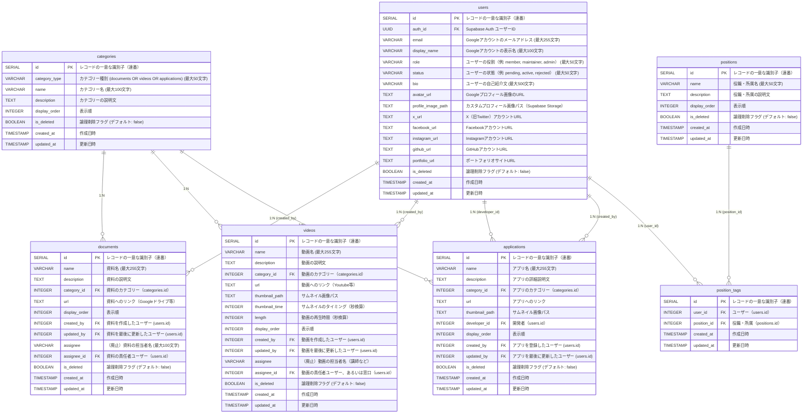

# データベース設計書

## 目次

1. [概要](#1-概要)
2. [テーブル設計](#2-テーブル設計)
3. [ER図](#3-er図)
4. [Row-Level-Security(RLS)ポリシー](#4-row-level-securityrlsポリシー)
5. [Supabase Storage](#5-supabase-storage)
6. [サポート関数・備考](#6-サポート関数備考)
7. [データアクセス制御の実現](#7-データアクセス制御の実現)

## 1. 概要

本プロジェクトでは、バックエンドサービスとしてSupabaseを採用しています。
Supabaseは、PostgreSQLを基盤としたオープンソースのバックエンドサービスです。

本プロジェクトでは以下の7種類のデータを管理します。

1. **ユーザー情報**（`users`テーブル）  
   Supabase Authと連携したユーザー情報を管理します。

2. **ドキュメント情報**（`documents`テーブル）  
   資料やリンクなどのドキュメント情報を管理します。

3. **動画情報**（`videos`テーブル）  
   再生時間やリンクなどの動画情報を管理します。

4. **カテゴリー情報**（`categories`テーブル）  
   ドキュメントや動画情報のカテゴリー種別を管理します。

5. **アプリ情報**（`applications`テーブル）  
   アプリ解説やリンクなどのアプリ情報を管理します。

6. **役職情報** (`positions`テーブル)  
   シンギュラリティ・ラボの役職・所属情報を管理します。

7. **役職タグ情報** (`position_tags`テーブル)  
   ユーザーに役職タグを紐付けます。

## 2. テーブル設計

### 2.1. users テーブル

| カラム名             | データ型       | 制約                                | 説明                                               |
| -------------------- | -------------- | ----------------------------------- | -------------------------------------------------- |
| `id`                 | `SERIAL`       | PRIMARY KEY                         | レコードの一意な識別子（連番）                     |
| `auth_id`            | `UUID`         | UNIQUE, NOT NULL, FK(auth.users.id) | Supabase Authのユーザー ID                         |
| `email`              | `VARCHAR(255)` | UNIQUE, NOT NULL                    | Googleアカウントのメールアドレス（最大255文字）    |
| `display_name`       | `VARCHAR(100)` | NOT NULL                            | Googleアカウントの表示名                           |
| `role`               | `VARCHAR(50)`  | DEFAULT 'member' NOT NULL           | ユーザーの役割（例: member, maintainer, admin）.   |
| `status`             | `VARCHAR(50)`  | DEFAULT 'pending' NOT NULL          | ユーザーの状態（例: pending, active, rejected）    |
| `bio`                | `VARCHAR(500)` |                                     | ユーザーの自己紹介文                               |
| `avatar_url`         | `TEXT`         |                                     | Googleプロフィール画像のURL                        |
| `profile_image_path` | `TEXT`         |                                     | カスタムプロフィール画像のパス（Supabase Storage） |
| `x_url`              | `TEXT`         |                                     | XアカウントのURL                                   |
| `facebook_url`       | `TEXT`         |                                     | FacebookアカウントのURL                            |
| `instagram_url`      | `TEXT`         |                                     | InstagramアカウントのURL                           |
| `github_url`         | `TEXT`         |                                     | GitHubアカウントのURL                              |
| `portfolio_url`      | `TEXT`         |                                     | ポートフォリオサイトのURL                          |
| `is_deleted`         | `BOOLEAN`      | DEFAULT FALSE, NOT NULL             | 論理削除フラグ                                     |
| `created_at`         | `TIMESTAMP`    | DEFAULT CURRENT_TIMESTAMP, NOT NULL | 作成日時                                           |
| `updated_at`         | `TIMESTAMP`    | DEFAULT CURRENT_TIMESTAMP, NOT NULL | 更新日時                                           |

---

### 2.2. documents テーブル

| カラム名        | データ型       | 制約                                 | 説明                               |
| --------------- | -------------- | ------------------------------------ | ---------------------------------- |
| `id`            | `SERIAL`       | PRIMARY KEY                          | レコードの一意な識別子（連番）     |
| `name`          | `VARCHAR(255)` | NOT NULL                             | 資料名                             |
| `description`   | `TEXT`         |                                      | 資料の説明文                       |
| `category_id`   | `INTEGER`      | FOREIGN KEY(categories.id), NOT NULL | 資料の分類                         |
| `url`           | `TEXT`         | NOT NULL                             | 資料へのリンク（Googleドライブ等） |
| `display_order` | `INTEGER`      | DEFAULT 0, NOT NULL                  | 表示順                             |
| `created_by`    | `INTEGER`      | FOREIGN KEY(users.id), NOT NULL      | 資料を作成したユーザー             |
| `updated_by`    | `INTEGER`      | FOREIGN KEY(users.id), NOT NULL      | 資料を最後に更新したユーザー       |
| `assignee`      | `VARCHAR(100)` |                                      | （廃止）資料の担当者名             |
| `assignee_id`   | `INTEGER`      | FOREIGN KEY(users.id)                | 資料の責任者ユーザー               |
| `is_deleted`    | `BOOLEAN`      | DEFAULT FALSE, NOT NULL              | 論理削除フラグ                     |
| `created_at`    | `TIMESTAMP`    | DEFAULT CURRENT_TIMESTAMP, NOT NULL  | 作成日時                           |
| `updated_at`    | `TIMESTAMP`    | DEFAULT CURRENT_TIMESTAMP, NOT NULL  | 更新日時                           |

---

### 2.3. videos テーブル

| カラム名         | データ型       | 制約                                 | 説明                                 |
| ---------------- | -------------- | ------------------------------------ | ------------------------------------ |
| `id`             | `SERIAL`       | PRIMARY KEY                          | レコードの一意な識別子（連番）       |
| `name`           | `VARCHAR(255)` | NOT NULL                             | 動画名                               |
| `description`    | `TEXT`         |                                      | 動画の説明文                         |
| `category_id`    | `INTEGER`      | FOREIGN KEY(categories.id), NOT NULL | 動画の分類                           |
| `url`            | `TEXT`         | NOT NULL                             | 動画へのリンク（Youtube等）          |
| `thumbnail_path` | `TEXT`         |                                      | サムネイル画像パス                   |
| `thumbnail_time` | `INTEGER`      |                                      | サムネイルのタイミング（秒換算）     |
| `length`         | `INTEGER`      |                                      | 動画の再生時間（秒換算）             |
| `display_order`  | `INTEGER`      | DEFAULT 0, NOT NULL                  | 表示順                               |
| `created_by`     | `INTEGER`      | FOREIGN KEY(users.id), NOT NULL      | 動画を作成したユーザー               |
| `updated_by`     | `INTEGER`      | FOREIGN KEY(users.id), NOT NULL      | 動画を最後に更新したユーザー         |
| `assignee`       | `VARCHAR(100)` |                                      | （廃止）動画の担当者名（講師など）   |
| `assignee_id`    | `INTEGER`      | FOREIGN KEY(users.id)                | 動画の責任者ユーザー（あるいは窓口） |
| `is_deleted`     | `BOOLEAN`      | DEFAULT FALSE, NOT NULL              | 論理削除フラグ                       |
| `created_at`     | `TIMESTAMP`    | DEFAULT CURRENT_TIMESTAMP, NOT NULL  | 作成日時                             |
| `updated_at`     | `TIMESTAMP`    | DEFAULT CURRENT_TIMESTAMP, NOT NULL  | 更新日時                             |

### 2.4. categories テーブル

| カラム名        | データ型       | 制約                                                | 説明                            |
| --------------- | -------------- | --------------------------------------------------- | ------------------------------- |
| `id`            | `SERIAL`       | PRIMARY KEY                                         | レコードの一意な識別子（連番）  |
| `category_type` | `VARCHAR(50)`  | NOT NULL, `documents` OR `videos` OR `applications` | カテゴリーの種別                |
| `name`          | `VARCHAR(100)` | NOT NULL                                            | カテゴリー名 （例: 事務局資料） |
| `description`   | `TEXT`         |                                                     | カテゴリーの説明文              |
| `display_order` | `INTEGER`      | DEFAULT 0, NOT NULL                                 | 表示順                          |
| `is_deleted`    | `BOOLEAN`      | DEFAULT FALSE, NOT NULL                             | 論理削除フラグ                  |
| `created_at`    | `TIMESTAMP`    | DEFAULT CURRENT_TIMESTAMP, NOT NULL                 | 作成日時                        |
| `updated_at`    | `TIMESTAMP`    | DEFAULT CURRENT_TIMESTAMP, NOT NULL                 | 更新日時                        |

### 2.5. applications テーブル

| カラム名         | データ型       | 制約                                 | 説明                           |
| ---------------- | -------------- | ------------------------------------ | ------------------------------ |
| `id`             | `SERIAL`       | PRIMARY KEY                          | レコードの一意な識別子（連番） |
| `name`           | `VARCHAR(255)` | NOT NULL                             | アプリ名                       |
| `description`    | `TEXT`         | NOT NULL                             | アプリの詳細説明文             |
| `category_id`    | `INTEGER`      | FOREIGN KEY(categories.id), NOT NULL | アプリのカテゴリー             |
| `url`            | `TEXT`         | NOT NULL                             | アプリへのリンク               |
| `thumbnail_path` | `TEXT`         |                                      | サムネイル画像パス             |
| `developer_id`   | `INTEGER`      | FOREIGN KEY(users.id)                | 開発者（ユーザーID）           |
| `display_order`  | `INTEGER`      | DEFAULT 0, NOT NULL                  | 表示順                         |
| `created_by`     | `INTEGER`      | FOREIGN KEY(users.id), NOT NULL      | アプリを登録したユーザー       |
| `updated_by`     | `INTEGER`      | FOREIGN KEY(users.id), NOT NULL      | アプリを最後に更新したユーザー |
| `is_deleted`     | `BOOLEAN`      | DEFAULT FALSE, NOT NULL              | 論理削除フラグ                 |
| `created_at`     | `TIMESTAMP`    | DEFAULT CURRENT_TIMESTAMP, NOT NULL  | 作成日時                       |
| `updated_at`     | `TIMESTAMP`    | DEFAULT CURRENT_TIMESTAMP, NOT NULL  | 更新日時                       |

### 2.6. positions テーブル

| カラム名        | データ型      | 制約                                | 説明                           |
| --------------- | ------------- | ----------------------------------- | ------------------------------ |
| `id`            | `SERIAL`      | PRIMARY KEY                         | レコードの一意な識別子（連番） |
| `name`          | `VARCHAR(50)` | NOT NULL                            | 役職・所属名                   |
| `description`   | `TEXT`        |                                     | 役職・所属の説明文             |
| `display_order` | `INTEGER`     | DEFAULT 0, NOT NULL                 | 表示順                         |
| `is_deleted`    | `BOOLEAN`     | DEFAULT FALSE, NOT NULL             | 論理削除フラグ                 |
| `created_at`    | `TIMESTAMP`   | DEFAULT CURRENT_TIMESTAMP, NOT NULL | 作成日時                       |
| `updated_at`    | `TIMESTAMP`   | DEFAULT CURRENT_TIMESTAMP, NOT NULL | 更新日時                       |

### 2.7. position_tags テーブル

| カラム名                 | データ型    | 制約                                | 説明                                       |
| ------------------------ | ----------- | ----------------------------------- | ------------------------------------------ |
| `id`                     | `SERIAL`    | PRIMARY KEY                         | レコードの一意な識別子（連番）             |
| `user_id`                | `INTEGER`   | FOREIGN KEY(users.id), NOT NULL     | ユーザーID                                 |
| `position_id`            | `INTEGER`   | FOREIGN KEY(positions.id), NOT NULL | 役職・所属ID                               |
| `created_at`             | `TIMESTAMP` | DEFAULT CURRENT_TIMESTAMP, NOT NULL | 作成日時                                   |
| `updated_at`             | `TIMESTAMP` | DEFAULT CURRENT_TIMESTAMP, NOT NULL | 更新日時                                   |
| `user_id`, `position_id` | -           | UNIQUE(user_id, position_id)        | 同一ユーザーに同じ役職を複数回割り当て不可 |

## 3. ER図


```mermaid
erDiagram
    users {
        SERIAL id PK "レコードの一意な識別子（連番）"
        UUID auth_id FK "Supabase Auth ユーザーID"
        VARCHAR email "Googleアカウントのメールアドレス (最大255文字)"
        VARCHAR display_name "Googleアカウントの表示名 (最大100文字)"
        VARCHAR role "ユーザーの役割（例: member, maintainer, admin） (最大50文字)"
        VARCHAR status "ユーザーの状態（例: pending, active, rejected） (最大50文字)"
        VARCHAR bio "ユーザーの自己紹介文 (最大500文字)"
        TEXT avatar_url "Googleプロフィール画像のURL"
        TEXT profile_image_path "カスタムプロフィール画像パス（Supabase Storage）"
        TEXT x_url "X（旧Twitter）アカウントURL"
        TEXT facebook_url "FacebookアカウントURL"
        TEXT instagram_url "InstagramアカウントURL"
        TEXT github_url "GitHubアカウントURL"
        TEXT portfolio_url "ポートフォリオサイトURL"
        BOOLEAN is_deleted "論理削除フラグ (デフォルト: false)"
        TIMESTAMP created_at "作成日時"
        TIMESTAMP updated_at "更新日時"
    }

    documents {
        SERIAL id PK "レコードの一意な識別子（連番）"
        VARCHAR name "資料名 (最大255文字)"
        TEXT description "資料の説明文"
        INTEGER category_id FK "資料のカテゴリー（categories.id）"
        TEXT url "資料へのリンク（Googleドライブ等）"
        INTEGER display_order "表示順"
        INTEGER created_by FK "資料を作成したユーザー (users.id)"
        INTEGER updated_by FK "資料を最後に更新したユーザー (users.id)"
        VARCHAR assignee "（廃止）資料の担当者名 (最大100文字)"
        INTEGER assignee_id FK "資料の責任者ユーザー（users.id）"
        BOOLEAN is_deleted "論理削除フラグ (デフォルト: false)"
        TIMESTAMP created_at "作成日時"
        TIMESTAMP updated_at "更新日時"
    }

    videos {
        SERIAL id PK "レコードの一意な識別子（連番）"
        VARCHAR name "動画名 (最大255文字)"
        TEXT description "動画の説明文"
        INTEGER category_id FK "動画のカテゴリー（categories.id）"
        TEXT url "動画へのリンク（Youtube等）"
        TEXT thumbnail_path "サムネイル画像パス"
        INTEGER thumbnail_time "サムネイルのタイミング（秒換算）"
        INTEGER length "動画の再生時間（秒換算）"
        INTEGER display_order "表示順"
        INTEGER created_by FK "動画を作成したユーザー (users.id)"
        INTEGER updated_by FK "動画を最後に更新したユーザー (users.id)"
        VARCHAR assignee "（廃止）動画の担当者名（講師など）"
        INTEGER assignee_id FK "動画の責任者ユーザー、あるいは窓口（users.id）"
        BOOLEAN is_deleted "論理削除フラグ (デフォルト: false)"
        TIMESTAMP created_at "作成日時"
        TIMESTAMP updated_at "更新日時"
    }

    applications {
        SERIAL id PK "レコードの一意な識別子（連番）"
        VARCHAR name "アプリ名 (最大255文字)"
        TEXT description "アプリの詳細説明文"
        INTEGER category_id FK "アプリのカテゴリー（categories.id）"
        TEXT url "アプリへのリンク"
        TEXT thumbnail_path "サムネイル画像パス"
        INTEGER developer_id FK "開発者（users.id）"
        INTEGER display_order "表示順"
        INTEGER created_by FK "アプリを登録したユーザー (users.id)"
        INTEGER updated_by FK "アプリを最後に更新したユーザー (users.id)"
        BOOLEAN is_deleted "論理削除フラグ (デフォルト: false)"
        TIMESTAMP created_at "作成日時"
        TIMESTAMP updated_at "更新日時"
    }

    categories {
        SERIAL id PK "レコードの一意な識別子（連番）"
        VARCHAR category_type "カテゴリー種別 (documents OR videos OR applications) (最大50文字)"
        VARCHAR name "カテゴリー名 (最大100文字)"
        TEXT description "カテゴリーの説明文"
        INTEGER display_order "表示順"
        BOOLEAN is_deleted "論理削除フラグ (デフォルト: false)"
        TIMESTAMP created_at "作成日時"
        TIMESTAMP updated_at "更新日時"
    }

    positions {
        SERIAL id PK "レコードの一意な識別子（連番）"
        VARCHAR name "役職・所属名 (最大50文字)"
        TEXT description "役職・所属の説明文"
        INTEGER display_order "表示順"
        BOOLEAN is_deleted "論理削除フラグ (デフォルト: false)"
        TIMESTAMP created_at "作成日時"
        TIMESTAMP updated_at "更新日時"
    }

    position_tags {
        SERIAL id PK "レコードの一意な識別子（連番）"
        INTEGER user_id FK "ユーザー（users.id）"
        INTEGER position_id FK "役職・所属（positions.id）"
        TIMESTAMP created_at "作成日時"
        TIMESTAMP updated_at "更新日時"
    }

    users ||--o{ documents : "1:N (created_by)"
    users ||--o{ videos : "1:N (created_by)"
    users ||--o{ applications : "1:N (developer_id)"
    users ||--o{ applications : "1:N (created_by)"
    users ||--o{ position_tags : "1:N (user_id)"
    positions ||--o{ position_tags : "1:N (position_id)"
    categories ||--o{ documents : "1:N"
    categories ||--o{ videos : "1:N"
    categories ||--o{ applications : "1:N"
```

## 4. Row Level Security（RLS）ポリシー

Supabaseでは、Row Level Security（RLS）を使用してデータアクセスを制御しています。以下に各テーブルのRLSポリシーを説明します。

尚、各ポリシーで繰り返し使用されるユーザー条件判定は、共通ヘルパー関数（`is_active_user()`・`is_content_manager()`・`is_admin()`）として切り出し、`supabase/migrations/03_functions/rls_helper_functions.sql` で定義しています。

### 4.1. users テーブルのRLSポリシー

定義ファイル:

| ポリシー                                 | 定義ファイル                                     |
| ---------------------------------------- | ------------------------------------------------ |
| SELECT・管理者によるUPDATE（現行定義）   | `04_policies/users/01_update_users_policies.sql` |
| INSERT・本人によるUPDATE・物理削除の禁止 | `04_policies/users/00_users_policies.sql`        |

> **`00_users_policies.sql` を単独で再実行しないこと**
> 同ファイルには旧定義（全認証ユーザーへのSELECT許可・`user_metadata` 依存の管理者判定）が残っています。permissive ポリシーはOR結合されるため、単独で再実行すると条件の緩い旧定義が復活し、修正が無効化されます。再実行する場合は必ず `01_update_users_policies.sql` も続けて実行してください。

- ユーザーは自身のデータを閲覧可能
  - 承認前（pending）・否認済み（rejected）のユーザーが自身のステータスを確認するために必要
- アクティブユーザーは削除されていない全データを閲覧可能
  - 会員一覧・承認待ち一覧・担当者選択など、他ユーザーを参照する機能で使用する
  - 承認前・否認済みのユーザーは他ユーザーのデータを閲覧できない
- 新規登録は、Supabase Authからの自動登録のみ許可
  - OAuth認証後のコールバック処理で、ユーザー自身のデータを登録する際に使用する
- ユーザーは自身のデータのみ更新可能
  - ただし `role` / `status` の書き換えはトリガーで禁止する（詳細は「6.4. users テーブルの role / status 保護トリガー」を参照）
- 管理者は全ユーザー情報を更新可能
  - 管理者判定は `is_active_user() AND is_admin()` で行う
- ユーザーは自分自身の論理削除のみ可能
  - 退会処理に相当する
- 管理者は全ユーザーの論理削除が可能
  - 管理者による利用停止処理などに使用する
- 論理削除のみとし、物理削除を防止

### 4.2. documents テーブルのRLSポリシー

- 認証済ユーザーは削除されていないデータのみ閲覧可能
- 管理者またはメンテナーは全データを閲覧可能
  - 削除機能があるため
- 管理者またはメンテナーは全データを登録・更新可能
- 論理削除のみとし、物理削除を防止

### 4.3. videos テーブルのRLSポリシー

- 認証済ユーザーは削除されていないデータのみ閲覧可能
- 管理者またはメンテナーは全データを閲覧可能
  - 削除機能があるため
- 管理者またはメンテナーは全データを登録・更新可能
- 論理削除のみとし、物理削除を防止

### 4.4. categories テーブルのRLSポリシー

- 認証済ユーザーは削除されていないデータのみ閲覧可能
- 管理者またはメンテナーは全データを閲覧・登録・更新可能
- 管理者またはメンテナーは論理削除が可能
  - 論理削除のみとし、物理削除を防止
  - 削除時の「未分類」への移動・自動作成はRLSではなくアプリケーション仕様として実装する（詳細は `docs/specification.md` の「8.2 基本機能 > [カテゴリー管理] > 5. 削除」を参照）

### 4.5. applications テーブルのRLSポリシー

- 認証済ユーザーは削除されていないデータのみ閲覧可能
- 管理者またはメンテナーは全データを閲覧可能
  - 削除機能があるため
- 管理者またはメンテナーは全データを登録・更新可能
- 論理削除のみとし、物理削除を防止

### 4.6. positions テーブルのRLSポリシー

- 認証済ユーザーは削除されていないデータのみ閲覧可能
- 管理者またはメンテナーは全データを閲覧可能
- 管理者またはメンテナーは全データを登録・更新可能
- 論理削除のみとし、物理削除を防止

### 4.7. position_tags テーブルのRLSポリシー

- 認証済ユーザーは全データを閲覧可能
  - 物理削除のため、削除フラグは考慮不要
- ユーザーは自身のデータのみ登録・更新可能
- 管理者またはメンテナーは全データを登録・更新可能
- ユーザーは自身のデータのみ物理削除可能
- 管理者またはメンテナーは全データを物理削除可能

### 4.8. profile-images Storage のRLSポリシー

- `status = 'active'` かつ未削除のユーザーのみ全プロフィール画像を閲覧可能
- ユーザーは自身の `auth_id` フォルダの `profile-image`（固定キー）のみアップロード・更新・削除可能

## 5. Supabase Storage

### 5.1. profile-images バケット

ユーザーがアップロードしたカスタムプロフィール画像を保存するバケット。

| 項目               | 値                                          |
| ------------------ | ------------------------------------------- |
| バケット名         | `profile-images`                            |
| 公開/非公開        | 非公開（Private）                           |
| ファイルパス形式   | `{auth_id}/profile-image`（拡張子なし固定） |
| 許可する拡張子     | `.jpg`, `.jpeg`, `.png`, `.gif`             |
| ファイルサイズ上限 | 1MB                                         |

#### 固定保存キーについて

保存パスを `{auth_id}/profile-image`（拡張子なし固定）とし、再アップロード時は常に同一オブジェクトを上書きすることで、不要なファイルの蓄積を防ぐ。
許可する拡張子（`.jpg`, `.jpeg`, `.png`, `.gif`）はアップロード可能な元ファイル形式を示すものであり、Storage 上の保存名には拡張子を含めない。

> **キャッシュ対策**: 同一キーへの上書きはブラウザキャッシュにより古い画像が表示され続ける問題が起きやすい。
> タイムスタンプ等の手動クエリパラメータをURLに付与するのではなく、Storageアップロード時に `cacheControl: "0"` を指定したうえで、画像更新時は署名付きURLを再取得すること。署名付きURLはSupabase側で呼び出しごとに新しいトークンが発行されるため、同一パスへの再アップロード後もURL文字列自体が変わり、ブラウザキャッシュを自然に回避できる。

## 6. サポート関数・備考

### 6.1. Supabase Auth 組み込み関数

- `auth.uid()`
  - Supabase Authが提供する組み込み関数で、現在のセッションで認証されているユーザーのUUIDを返す。未認証の場合はNULLを返す。RLSポリシーでユーザー識別に使用される。これが主要な認証識別関数として使用される。

### 6.2. RLS ヘルパー関数

定義ファイル: `supabase/migrations/03_functions/rls_helper_functions.sql`

各テーブルのRLSポリシーで共通して使用されるユーザー条件判定を関数化します。ポリシー内で同じ `EXISTS (SELECT 1 FROM users ...)` の記述が何度も繰り返されるのを防ぎ、可読性と保守性を高めます。

| 関数名                 | 戻り値    | 概要                                                                                                                                                                                                                         |
| ---------------------- | --------- | ---------------------------------------------------------------------------------------------------------------------------------------------------------------------------------------------------------------------------- |
| `is_active_user()`     | `BOOLEAN` | 現在のユーザーが `status = 'active'` かつ未削除のユーザーかを判定する。承認前・退会済みユーザーのアクセスを弾く用途で使用。                                                                                                  |
| `is_content_manager()` | `BOOLEAN` | 現在のユーザーが `admin` または `maintainer` ロールを持つかを判定する。コンテンツの閲覧（削除済み含む）・登録・更新・削除権限の確認に使用。必ず `is_active_user()` と組み合わせて使用すること。                              |
| `is_admin()`           | `BOOLEAN` | 現在のユーザーがDB上の `users.role` で `admin` ロールを持つかを判定する（JWTのクレームは参照しない）。ユーザーの承認・権限変更・利用停止など管理者専用操作の確認に使用。必ず `is_active_user()` と組み合わせて使用すること。 |

いずれも `SECURITY DEFINER` で定義しており、**後述の前提条件を満たす場合に限り**関数内の `SELECT` はRLSを経由しない。このため `users` テーブル自身のポリシーからこれらの関数（内部で `users` を参照する）を呼び出しても再帰は発生しない。

`SECURITY DEFINER` それ自体がRLSを無効化するわけではなく、関数の実行ユーザーが所有者に切り替わることで結果的にRLSを免除される仕組みである。**関数の所有者が `users` の所有者と一致し、かつ `users` に `FORCE ROW LEVEL SECURITY` が設定されていないこと**が前提となる。この前提が崩れると `42P17 infinite recursion detected in policy for relation "users"` が発生し、`users` へのSELECTが全面的に失敗する。前提はSupabaseのSQLエディタ経由（`postgres` 所有）であれば既定で成立するが、ポリシー適用前に確認しておくとよい。

```sql
SELECT p.proname,
       pg_get_userbyid(p.proowner) AS func_owner,
       pg_get_userbyid(c.relowner) AS table_owner,
       c.relforcerowsecurity
FROM pg_proc p
CROSS JOIN pg_class c
WHERE p.proname IN ('is_active_user', 'is_admin', 'is_content_manager')
  AND p.pronamespace = 'public'::regnamespace
  AND c.oid = 'public.users'::regclass;
```

なお `users` テーブルのポリシーではこれらの関数呼び出しを `(SELECT is_active_user())` のようにサブクエリでラップしている。相関のないスカラサブクエリはInitPlanとして評価されるため、候補行ごとではなくステートメントあたり1回の評価で済む。

### 6.3. ポリシー構文の補足

- `USING` は更新対象の行を選択する条件、`WITH CHECK` は更新後の値をチェックする条件を指定している

### 6.4. users テーブルの role / status 保護トリガー

定義ファイル: `supabase/migrations/02_triggers/users_triggers.sql`

RLSは行単位の制御であり、カラム単位の制限ができません。`users` テーブルは「ユーザーは自身のデータのみ更新可能」というポリシーを持つため、RLSだけでは自身の `role` / `status` の書き換え（権限昇格・承認バイパス）を防げません。これを `enforce_users_role_and_status()` トリガー関数で補います。

| 契機                            | 挙動                                                     |
| ------------------------------- | -------------------------------------------------------- |
| `BEFORE INSERT`                 | `role` を `'member'`、`status` を `'pending'` に固定する |
| `BEFORE UPDATE OF role, status` | `role` / `status` を更新前の値のまま維持する             |

UPDATE は列指定トリガー（`UPDATE OF role, status`）とし、`role` / `status` が SET 句に含まれる場合のみ発火させています。UPDATE 文は SET 句にないカラムを変更できないため保護対象を取りこぼすことはなく、プロフィール更新や `avatar_url` 更新では発火しないため不要なヘルパー関数の評価を避けられます。

以下のいずれかに該当する場合はトリガーによる固定を行いません。

- `is_active_user() AND is_admin()` が真（承認済み管理者による承認・権限変更・利用停止）
  - `is_admin()` は role のみを判定するため、必ず `is_active_user()` と組み合わせる。単独で使用すると、`status` が `pending` / `rejected` の管理者が自身の `status` を `active` に戻せてしまう
- `auth.uid()` が `NULL`（SQLエディタや service_role キーによるDB管理操作。初期管理者の `role` 設定はこの経路で行う）

> **`DEFAULT` 制約では防げない理由**
> カラムの `DEFAULT` は値が明示指定されなかった場合にのみ適用されるため、クライアントが `insert({ role: 'admin', status: 'active' })` のように値を明示すると効きません。値の明示指定を含めて固定するにはトリガーが必要です。

> **適用順の制約**
> 本トリガー関数は `03_functions/rls_helper_functions.sql` の `is_active_user()` / `is_admin()` を参照します。ディレクトリの番号順（`02_triggers` → `03_functions`）とは逆の依存関係になるため、**必ず `03_functions/rls_helper_functions.sql` を先に適用してください**。関数の作成自体は遅延解決のため成功しますが、関数が未定義のままトリガーが発火すると `function is_admin() does not exist` で失敗します。影響を受けるのは新規ユーザー登録（INSERT）と `role` / `status` を含む UPDATE で、承認・否認が行えなくなります。

## 7. データアクセス制御の実現

これらのRLSポリシーとSupabase Auth統合により、シンラボポータルサイトでは以下のデータアクセス制御を実現しています。

- **認証ベースアクセス**: Supabase Authで認証されたユーザーのみアクセス可能
- **管理者特権**: 管理者は全ユーザー情報を閲覧・更新可能、およびコンテンツ管理権限
- **メンテナー権限**: メンテナーはコンテンツの追加・編集・削除が可能
- **メンバー限定コンテンツ**: 認証済みユーザーのみがコンテンツを閲覧可能
- **データ保全**: 物理削除は禁止され、論理削除のみ許可（データの整合性保持）
- **シンプルな権限管理**: Supabase Authとの統合により、複雑な認証連携処理が不要
