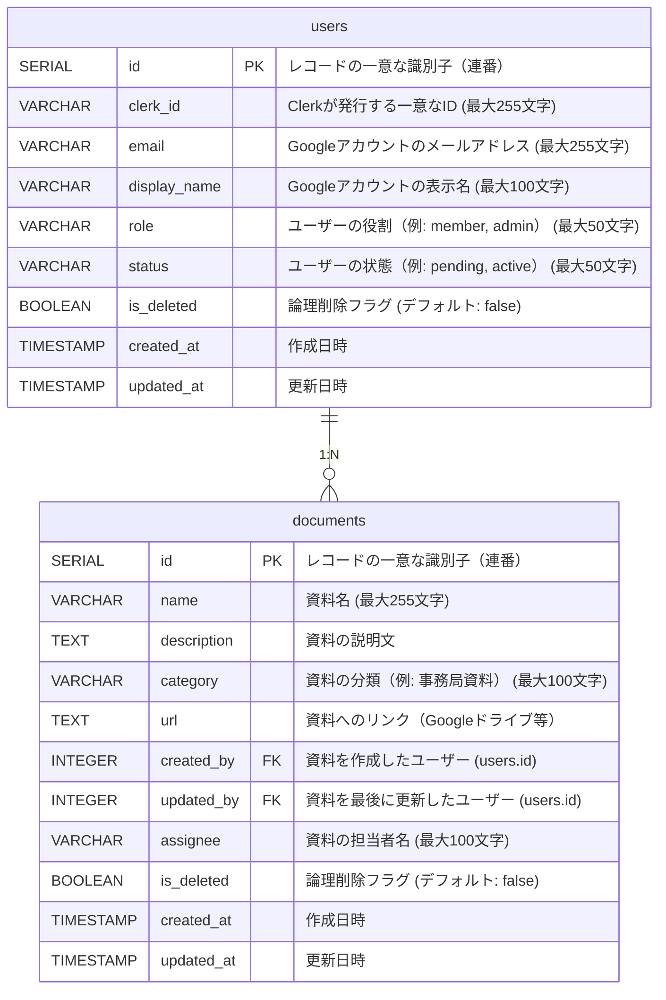

# データベース設計書

## 1. 概要

本プロジェクトでは、バックエンドサービスとしてSupabaseを採用している。  
Supabaseは、PostgreSQLを基盤としたオープンソースのバックエンドサービスである。

本プロジェクトでは以下の2種類のデータを管理する

1. **ユーザー情報**（`users`テーブル）  
   Googleアカウント認証を活用したユーザー情報を管理します。

2. **ドキュメント情報**（`documents`テーブル）  
   資料やリンクなどのドキュメント情報を管理します。

## 2. テーブル設計

### 2.1. users テーブル

| カラム名         | データ型         | 制約                             | 説明                            |
|------------------|------------------|----------------------------------|---------------------------------|
| `id`            | `SERIAL`         | PRIMARY KEY                     | レコードの一意な識別子（連番）  |
| `clerk_id`      | `VARCHAR(255)`   | UNIQUE, NOT NULL                | Clerkが発行する一意なID         |
| `email`         | `VARCHAR(255)`   | UNIQUE, NOT NULL                | Googleアカウントのメールアドレス（最大255文字） |
| `display_name`  | `VARCHAR(100)`   | NOT NULL                        | Googleアカウントの表示名        |
| `role`          | `VARCHAR(50)`    | DEFAULT 'member'  NOT NULL      | ユーザーの役割（例: member, admin） |
| `status`        | `VARCHAR(50)`    | DEFAULT 'pending' NOT NULL      | ユーザーの状態（例: pending, active） |
| `is_deleted`    | `BOOLEAN`        | DEFAULT FALSE, NOT NULL         | 論理削除フラグ                  |
| `created_at`    | `TIMESTAMP`      | DEFAULT CURRENT_TIMESTAMP, NOT NULL | 作成日時                   |
| `updated_at`    | `TIMESTAMP`      | DEFAULT CURRENT_TIMESTAMP, NOT NULL | 更新日時                   |

---

### 2.2. documents テーブル

| カラム名         | データ型         | 制約                             | 説明                            |
|------------------|------------------|----------------------------------|---------------------------------|
| `id`            | `SERIAL`         | PRIMARY KEY                     | レコードの一意な識別子（連番）  |
| `name`          | `VARCHAR(255)`   | NOT NULL                        | 資料名                          |
| `description`   | `TEXT`           |                                  | 資料の説明文                     |
| `category`      | `VARCHAR(100)`   | NOT NULL                        | 資料の分類（例: 事務局資料）     |
| `url`           | `TEXT`           | NOT NULL                        | 資料へのリンク（Googleドライブ等） |
| `created_by`    | `INTEGER`        | FOREIGN KEY(users.id), NOT NULL | 資料を作成したユーザー           |
| `updated_by`    | `INTEGER`        | FOREIGN KEY(users.id), NOT NULL | 資料を最後に更新したユーザー     |
| `assignee`      | `VARCHAR(100)`   |                                  | 資料の担当者名                   |
| `is_deleted`    | `BOOLEAN`        | DEFAULT FALSE, NOT NULL         | 論理削除フラグ                  |
| `created_at`    | `TIMESTAMP`      | DEFAULT CURRENT_TIMESTAMP, NOT NULL | 作成日時                   |
| `updated_at`    | `TIMESTAMP`      | DEFAULT CURRENT_TIMESTAMP, NOT NULL | 更新日時                   |

## 3. ER図

