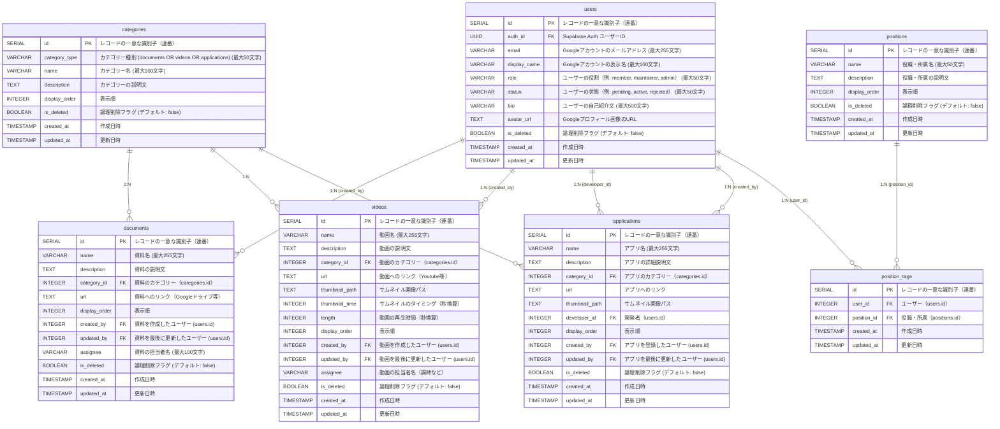

# データベース設計書

## 目次

1. [概要](#1-概要)
2. [テーブル設計](#2-テーブル設計)
3. [ER図](#3-er図)
4. [Row-Level-Security(RLS)ポリシー](#4-row-level-securityrlsポリシー)
5. [サポート関数](#5-サポート関数)
6. [データアクセス制御の実現](#6-データアクセス制御の実現)

## 1. 概要

本プロジェクトでは、バックエンドサービスとしてSupabaseを採用しています。
Supabaseは、PostgreSQLを基盤としたオープンソースのバックエンドサービスです。

本プロジェクトでは以下の5種類のデータを管理します。

1. **ユーザー情報**（`users`テーブル）  
   Supabase Authと連携したユーザー情報を管理します。

2. **ドキュメント情報**（`documents`テーブル）  
   資料やリンクなどのドキュメント情報を管理します。

3. **動画情報**（`videos`テーブル）  
   再生時間やリンクなどの動画情報を管理します。

4. **カテゴリー情報**（`categories`テーブル）  
   ドキュメントや動画情報のカテゴリー種別を管理します。

5. **アプリ情報**（`applications`テーブル）  
   アプリ解説やリンクなどのアプリ情報を管理します。

6. **役職情報** (`positions`テーブル)  
   シンギュラリティ・ラボの役職・所属情報を管理します。

7. **役職タグ情報** (`position_tags`テーブル)  
   ユーザーに役職タグを紐付けます。

## 2. テーブル設計

### 2.1. users テーブル

| カラム名       | データ型       | 制約                                | 説明                                             |
| -------------- | -------------- | ----------------------------------- | ------------------------------------------------ |
| `id`           | `SERIAL`       | PRIMARY KEY                         | レコードの一意な識別子（連番）                   |
| `auth_id`      | `UUID`         | UNIQUE, NOT NULL, FK(auth.users.id) | Supabase Authのユーザー ID                       |
| `email`        | `VARCHAR(255)` | UNIQUE, NOT NULL                    | Googleアカウントのメールアドレス（最大255文字）  |
| `display_name` | `VARCHAR(100)` | NOT NULL                            | Googleアカウントの表示名                         |
| `role`         | `VARCHAR(50)`  | DEFAULT 'member' NOT NULL           | ユーザーの役割（例: member, maintainer, admin）. |
| `status`       | `VARCHAR(50)`  | DEFAULT 'pending' NOT NULL          | ユーザーの状態（例: pending, active, rejected）  |
| `bio`          | `VARCHAR(500)` |                                     | ユーザーの自己紹介文                             |
| `avatar_url`   | `TEXT`         |                                     | Googleプロフィール画像のURL                      |
| `is_deleted`   | `BOOLEAN`      | DEFAULT FALSE, NOT NULL             | 論理削除フラグ                                   |
| `created_at`   | `TIMESTAMP`    | DEFAULT CURRENT_TIMESTAMP, NOT NULL | 作成日時                                         |
| `updated_at`   | `TIMESTAMP`    | DEFAULT CURRENT_TIMESTAMP, NOT NULL | 更新日時                                         |

---

### 2.2. documents テーブル

| カラム名        | データ型       | 制約                                 | 説明                               |
| --------------- | -------------- | ------------------------------------ | ---------------------------------- |
| `id`            | `SERIAL`       | PRIMARY KEY                          | レコードの一意な識別子（連番）     |
| `name`          | `VARCHAR(255)` | NOT NULL                             | 資料名                             |
| `description`   | `TEXT`         |                                      | 資料の説明文                       |
| `category_id`   | `INTEGER`      | FOREIGN KEY(categories.id), NOT NULL | 資料の分類                         |
| `url`           | `TEXT`         | NOT NULL                             | 資料へのリンク（Googleドライブ等） |
| `display_order` | `INTEGER`      |                                      | 表示順                             |
| `created_by`    | `INTEGER`      | FOREIGN KEY(users.id), NOT NULL      | 資料を作成したユーザー             |
| `updated_by`    | `INTEGER`      | FOREIGN KEY(users.id), NOT NULL      | 資料を最後に更新したユーザー       |
| `assignee`      | `VARCHAR(100)` |                                      | 資料の担当者名                     |
| `is_deleted`    | `BOOLEAN`      | DEFAULT FALSE, NOT NULL              | 論理削除フラグ                     |
| `created_at`    | `TIMESTAMP`    | DEFAULT CURRENT_TIMESTAMP, NOT NULL  | 作成日時                           |
| `updated_at`    | `TIMESTAMP`    | DEFAULT CURRENT_TIMESTAMP, NOT NULL  | 更新日時                           |

---

### 2.3. videos テーブル

| カラム名         | データ型       | 制約                                 | 説明                             |
| ---------------- | -------------- | ------------------------------------ | -------------------------------- |
| `id`             | `SERIAL`       | PRIMARY KEY                          | レコードの一意な識別子（連番）   |
| `name`           | `VARCHAR(255)` | NOT NULL                             | 動画名                           |
| `description`    | `TEXT`         |                                      | 動画の説明文                     |
| `category_id`    | `INTEGER`      | FOREIGN KEY(categories.id), NOT NULL | 動画の分類                       |
| `url`            | `TEXT`         | NOT NULL                             | 動画へのリンク（Youtube等）      |
| `thumbnail_path` | `TEXT`         |                                      | サムネイル画像パス               |
| `thumbnail_time` | `INTEGER`      |                                      | サムネイルのタイミング（秒換算） |
| `length`         | `INTEGER`      |                                      | 動画の再生時間（秒換算）         |
| `display_order`  | `INTEGER`      |                                      | 表示順                           |
| `created_by`     | `INTEGER`      | FOREIGN KEY(users.id), NOT NULL      | 動画を作成したユーザー           |
| `updated_by`     | `INTEGER`      | FOREIGN KEY(users.id), NOT NULL      | 動画を最後に更新したユーザー     |
| `assignee`       | `VARCHAR(100)` |                                      | 動画の担当者名（講師など）       |
| `is_deleted`     | `BOOLEAN`      | DEFAULT FALSE, NOT NULL              | 論理削除フラグ                   |
| `created_at`     | `TIMESTAMP`    | DEFAULT CURRENT_TIMESTAMP, NOT NULL  | 作成日時                         |
| `updated_at`     | `TIMESTAMP`    | DEFAULT CURRENT_TIMESTAMP, NOT NULL  | 更新日時                         |

### 2.4. categories テーブル

| カラム名        | データ型       | 制約                                                | 説明                            |
| --------------- | -------------- | --------------------------------------------------- | ------------------------------- |
| `id`            | `SERIAL`       | PRIMARY KEY                                         | レコードの一意な識別子（連番）  |
| `category_type` | `VARCHAR(50)`  | NOT NULL, `documents` OR `videos` OR `applications` | カテゴリーの種別                |
| `name`          | `VARCHAR(100)` | NOT NULL                                            | カテゴリー名 （例: 事務局資料） |
| `description`   | `TEXT`         |                                                     | カテゴリーの説明文              |
| `display_order` | `INTEGER`      |                                                     | 表示順                          |
| `is_deleted`    | `BOOLEAN`      | DEFAULT FALSE, NOT NULL                             | 論理削除フラグ                  |
| `created_at`    | `TIMESTAMP`    | DEFAULT CURRENT_TIMESTAMP, NOT NULL                 | 作成日時                        |
| `updated_at`    | `TIMESTAMP`    | DEFAULT CURRENT_TIMESTAMP, NOT NULL                 | 更新日時                        |

### 2.5. applications テーブル

| カラム名         | データ型       | 制約                                 | 説明                           |
| ---------------- | -------------- | ------------------------------------ | ------------------------------ |
| `id`             | `SERIAL`       | PRIMARY KEY                          | レコードの一意な識別子（連番） |
| `name`           | `VARCHAR(255)` | NOT NULL                             | アプリ名                       |
| `description`    | `TEXT`         | NOT NULL                             | アプリの詳細説明文             |
| `category_id`    | `INTEGER`      | FOREIGN KEY(categories.id), NOT NULL | アプリのカテゴリー             |
| `url`            | `TEXT`         | NOT NULL                             | アプリへのリンク               |
| `thumbnail_path` | `TEXT`         |                                      | サムネイル画像パス             |
| `developer_id`   | `INTEGER`      | FOREIGN KEY(users.id), NOT NULL      | 開発者（ユーザーID）           |
| `display_order`  | `INTEGER`      |                                      | 表示順                         |
| `created_by`     | `INTEGER`      | FOREIGN KEY(users.id), NOT NULL      | アプリを登録したユーザー       |
| `updated_by`     | `INTEGER`      | FOREIGN KEY(users.id), NOT NULL      | アプリを最後に更新したユーザー |
| `is_deleted`     | `BOOLEAN`      | DEFAULT FALSE, NOT NULL              | 論理削除フラグ                 |
| `created_at`     | `TIMESTAMP`    | DEFAULT CURRENT_TIMESTAMP, NOT NULL  | 作成日時                       |
| `updated_at`     | `TIMESTAMP`    | DEFAULT CURRENT_TIMESTAMP, NOT NULL  | 更新日時                       |

### 2.6. positions テーブル

| カラム名        | データ型      | 制約                                | 説明                           |
| --------------- | ------------- | ----------------------------------- | ------------------------------ |
| `id`            | `SERIAL`      | PRIMARY KEY                         | レコードの一意な識別子（連番） |
| `name`          | `VARCHAR(50)` | NOT NULL                            | 役職・所属名                   |
| `description`   | `TEXT`        |                                     | 役職・所属の説明文             |
| `display_order` | `INTEGER`     |                                     | 表示順                         |
| `is_deleted`    | `BOOLEAN`     | DEFAULT FALSE, NOT NULL             | 論理削除フラグ                 |
| `created_at`    | `TIMESTAMP`   | DEFAULT CURRENT_TIMESTAMP, NOT NULL | 作成日時                       |
| `updated_at`    | `TIMESTAMP`   | DEFAULT CURRENT_TIMESTAMP, NOT NULL | 更新日時                       |

### 2.7. position_tags テーブル

| カラム名      | データ型    | 制約                                | 説明                           |
| ------------- | ----------- | ----------------------------------- | ------------------------------ |
| `id`          | `SERIAL`    | PRIMARY KEY                         | レコードの一意な識別子（連番） |
| `user_id`     | `INTEGER`   | FOREIGN KEY(users.id), NOT NULL     | ユーザーID                     |
| `position_id` | `INTEGER`   | FOREIGN KEY(positions.id), NOT NULL | 役職・所属ID                   |
| `created_at`  | `TIMESTAMP` | DEFAULT CURRENT_TIMESTAMP, NOT NULL | 作成日時                       |
| `updated_at`  | `TIMESTAMP` | DEFAULT CURRENT_TIMESTAMP, NOT NULL | 更新日時                       |

## 3. ER図



## 4. Row Level Security（RLS）ポリシー

Supabaseでは、Row Level Security（RLS）を使用してデータアクセスを制御しています。以下に各テーブルのRLSポリシーを説明します。

### 4.1. users テーブルのRLSポリシー

#### 閲覧ポリシー（SELECT）

- `users_can_read_own_data`: ユーザーは自分自身のデータのみ閲覧可能

  - 条件: `auth_id = auth.uid() AND is_deleted = FALSE`
  - 解説: 論理削除されていない自分自身のレコードのみ閲覧可能。`auth.uid()`はSupabase Authの組み込み関数で、現在認証されているユーザーのUUIDを返す。

- `admins_can_read_all_users`: 管理者は全ユーザーデータを閲覧可能
  - 条件:
    ```sql
    EXISTS (
        SELECT 1 FROM users
        WHERE
        auth_id = auth.uid()
        AND role = 'admin'
        AND status = 'active'
        AND is_deleted = FALSE
    )
    ```
  - 解説: 現在ログインしているユーザーが管理者ロール（role = 'admin'）であり、承認済み (status = 'active') かつ論理削除されていない場合に全ユーザーデータの閲覧を許可。

#### 挿入ポリシー（INSERT）

- `authenticated_users_can_insert_own_data`: 認証済みユーザーは自分自身のデータを挿入可能
  - 条件: `true`（実質的にサービスロールからの実行のみ許可）
  - 解説: OAuth認証後のコールバック処理で、ユーザー自身のデータをusersテーブルに登録する際に使用。

#### 更新ポリシー（UPDATE）

- `users_can_update_own_data`: ユーザーは自分自身の情報のみ更新可能

  - 条件1（USING）: `auth_id = auth.uid() AND is_deleted = FALSE`
  - 条件2（WITH CHECK）: `auth_id = auth.uid() AND is_deleted = FALSE`
  - 解説: 自分自身のデータのみ更新可能で、かつ論理削除されていない場合に限る。USINGは更新対象の行を選択する条件、WITH CHECKは更新後の値をチェックする条件を指定。ユーザーは自分のプロフィール情報などを変更できる。

- `admins_can_update_all_users`: 管理者はすべてのユーザー情報を更新可能
  - 条件:
    ```sql
    EXISTS (
        SELECT 1 FROM users
        WHERE
        auth_id = auth.uid()
        AND role = 'admin'
        AND status = 'active'
        AND is_deleted = FALSE
    )
    ```
  - 解説: 管理者ロール（role = 'admin'）を持つユーザーは全ユーザーの情報を更新可能。管理者はユーザーのステータス変更や権限管理などを行える。

#### 削除ポリシー（DELETE/論理削除）

- `users_can_delete_own_data`: ユーザーは自分自身の論理削除のみ可能

  - 条件1（USING）: `auth_id = auth.uid() AND is_deleted = FALSE`
  - 条件2（WITH CHECK）: `auth_id = auth.uid() AND is_deleted = TRUE`
  - 解説: ユーザーは自分自身のデータのみ論理削除可能。実際には物理削除ではなく、`is_deleted = TRUE`に更新することで論理削除を実現。退会処理に相当する。

- `admins_can_delete_users`: 管理者はユーザーの論理削除が可能
  - 条件:
    ```sql
    EXISTS (
        SELECT 1 FROM users
        WHERE
        auth_id = auth.uid()
        AND role = 'admin'
        AND status = 'active'
        AND is_deleted = FALSE
    )
    ```
  - 解説: 管理者ロールを持つユーザーは、他のユーザーも含めて論理削除が可能。管理者による利用停止処理などに使用される。

### 4.2. documents テーブルのRLSポリシー

#### 閲覧ポリシー（SELECT）

- `authenticated_users_can_read_documents`: 認証済みユーザーは全てのdocumentsを閲覧可能
  - 条件: `auth_id = auth.uid() AND status  = 'active' AND is_deleted = FALSE`
  - 解説: Supabase Authで認証されたユーザーであれば、論理削除されていない全ての資料にアクセス可能

#### 作成ポリシー（INSERT）

- `content_managers_can_insert_documents`: 管理者またはメンテナーが資料を作成可能
  - 条件:
    ```sql
    EXISTS (
        SELECT 1 FROM users
        WHERE
        auth_id = auth.uid()
        AND role IN ('admin', 'maintainer')
        AND status = 'active'
        AND is_deleted = FALSE
    )
    ```
  - 解説: 管理者またはメンテナー権限を持つアクティブなユーザーのみが新しい資料を追加可能

#### 更新ポリシー（UPDATE）

- `content_managers_can_update_documents`: 管理者またはメンテナーが資料を更新可能
  - 条件: content_managers_can_insert_documentsと同様
  - 解説: 管理者またはメンテナー権限を持つユーザーが既存の資料を編集可能

#### 削除ポリシー（DELETE/論理削除）

- `prevent_physical_delete_documents`: 資料は論理削除のみとし、物理削除を防止

### 4.3. videos テーブルのRLSポリシー

#### 閲覧ポリシー（SELECT）

- `authenticated_users_can_read_videos`: 認証済みユーザーは全てのvideosを閲覧可能
  - 条件: `auth_id = auth.uid() AND status  = 'active' AND is_deleted = FALSE`
  - 解説: Supabase Authで認証されたユーザーであれば、論理削除されていない全ての動画にアクセス可能

#### 作成ポリシー（INSERT）

- `content_managers_can_insert_videos`: 管理者またはメンテナーが動画を作成可能
  - 条件:
    ```sql
    EXISTS (
        SELECT 1 FROM users
        WHERE
        auth_id = auth.uid()
        AND role IN ('admin', 'maintainer')
        AND status = 'active'
        AND is_deleted = FALSE
    )
    ```
  - 解説: 管理者またはメンテナー権限を持つアクティブなユーザーのみが新しい動画を追加可能

#### 更新ポリシー（UPDATE）

- `content_managers_can_update_videos`: 管理者またはメンテナーが動画を更新可能
  - 条件: content_managers_can_insert_videosと同様
  - 解説: 管理者またはメンテナー権限を持つユーザーが既存の動画を編集可能

#### 削除ポリシー（DELETE/論理削除）

- `prevent_physical_delete_videos`: 資料は論理削除のみとし、物理削除を防止

### 4.4. categories テーブルのRLSポリシー

#### 閲覧ポリシー（SELECT）

- `registered_users_can_read_categories`: 登録済みユーザーは全てのcategoriesを閲覧可能
  - 条件: `auth_id = auth.uid()　AND status = 'active' AND is_deleted = FALSE`
  - 解説: documentsテーブルと同様に、`auth.uid()`を使用して、ログインユーザーが正規登録されたシンラボメンバーであり、承認済み (status = 'active') かつ論理削除されていないことを確認する。この条件を満たすユーザーのみが、論理削除されていない全てのカテゴリー（categories）にアクセスできる。会員以外の一般ユーザーは閲覧できない仕組みになっている。

### 4.5. applications テーブルのRLSポリシー

#### 閲覧ポリシー（SELECT）

- `authenticated_users_can_read_applications`: 認証済みユーザーは全てのapplicationsを閲覧可能
  - 条件:
    ```sql
    EXISTS (
      SELECT 1 FROM users
      WHERE auth_id = auth.uid()
      AND status = 'active'
      AND is_deleted = false
    )
    AND is_deleted = FALSE
    ```
  - 解説: Supabase Authで認証されたアクティブなユーザーであれば、論理削除されていない全てのアプリにアクセス可能

#### 作成ポリシー（INSERT）

- `content_managers_can_insert_applications`: 管理者またはメンテナーがアプリを登録可能
  - 条件:
    ```sql
    EXISTS (
      SELECT 1 FROM users
      WHERE
        auth_id = auth.uid()
        AND role IN ('admin', 'maintainer')
        AND status = 'active'
        AND is_deleted = FALSE
    )
    ```
  - 解説: 管理者またはメンテナー権限を持つアクティブなユーザーのみが新しいアプリを追加可能

#### 更新ポリシー（UPDATE）

- `content_managers_can_update_applications`: 管理者またはメンテナーがアプリを更新可能
  - 条件: content_managers_can_insert_applicationsと同様
  - 解説: 管理者またはメンテナー権限を持つユーザーが既存のアプリを編集可能

#### 削除ポリシー（DELETE/論理削除）

- `prevent_physical_delete_applications`: アプリは論理削除のみとし、物理削除を防止

### 4.6. positions テーブルのRLSポリシー

documents テーブルと同様

### 4.7. position_tags テーブルのRLSポリシー

documents テーブルと同様
ただし、削除ポリシーは物理削除とする

## 5. サポート関数

- `auth.uid()`: 現在認証されているユーザーのUUIDを取得
  - 解説: Supabase Authが提供する組み込み関数で、現在のセッションで認証されているユーザーのUUIDを返す。未認証の場合はNULLを返す。RLSポリシーでユーザー識別に使用される。これが主要な認証識別関数として使用される。

## 6. データアクセス制御の実現

これらのRLSポリシーとSupabase Auth統合により、シンラボポータルサイトでは以下のデータアクセス制御を実現しています。

- **認証ベースアクセス**: Supabase Authで認証されたユーザーのみアクセス可能
- **管理者特権**: 管理者は全ユーザー情報を閲覧・更新可能、およびコンテンツ管理権限
- **メンテナー権限**: メンテナーはコンテンツの追加・編集・削除が可能
- **メンバー限定コンテンツ**: 認証済みユーザーのみがコンテンツを閲覧可能
- **データ保全**: 物理削除は禁止され、論理削除のみ許可（データの整合性保持）
- **シンプルな権限管理**: Supabase Authとの統合により、複雑な認証連携処理が不要
