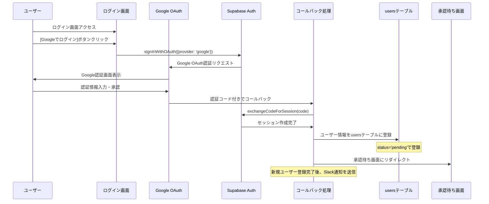
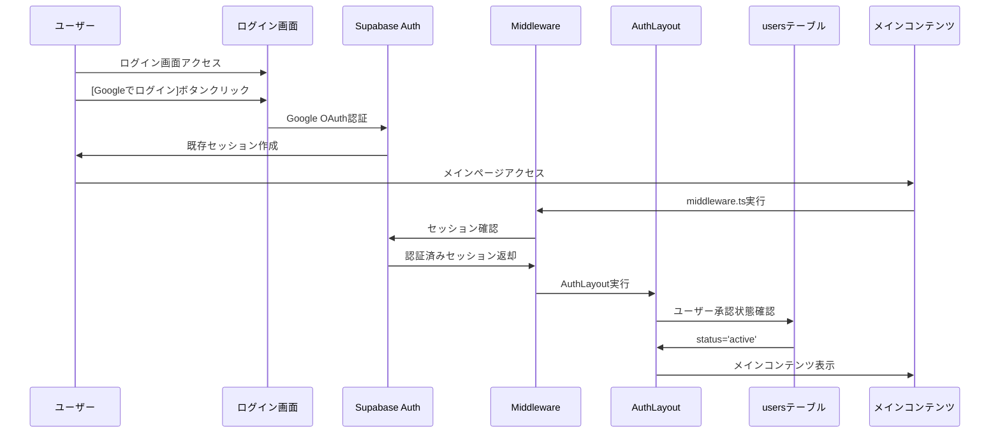
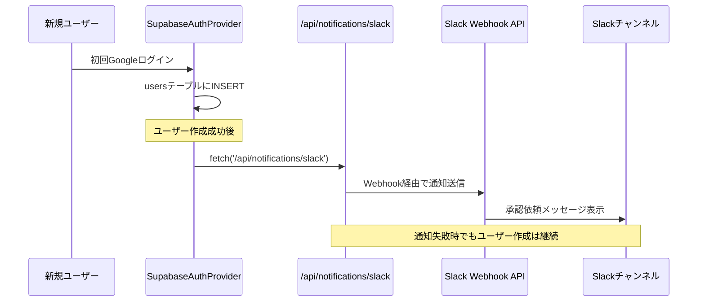

# シンラボポータルサイト機能仕様書

## 目次

1. [概要](#1-概要)
2. [認証機能](#2-認証機能)
3. [資料一覧ページ](#3-資料一覧ページ)
4. [動画一覧ページ](#4-動画一覧ページ)
5. [プロフィールページ](#5-プロフィールページ)
6. [会員一覧ページ](#6-会員一覧ページ)
7. [アプリ紹介ページ](#7-アプリ紹介ページ)
8. [管理画面](#8-管理画面)

## 1. 概要

### 1.1 目的

シンラボメンバーがサロン内の各種サービスやリソースをより効率的に活用できるよう、サロン機能を段階的に拡充する。メンバーの利便性を向上させ、より快適な学習・活動環境を提供することを目指す。

### 1.2 開発方針

- 段階的な機能拡充
- 各機能は必要最小限の実装からスタート
- ユーザーフィードバックを基に改善・拡張
- 既存システムとの整合性を維持

## 2. 認証機能

### 2.1 機能概要

Supabase Authを使用したGoogleアカウントでの認証機能を提供し、ログインしたメンバーの情報をSupabaseのデータベースで管理する。

- **認証プロバイダー**: Supabase Auth（Google OAuth）
- **データ管理**: Supabase PostgreSQL
- **権限制御**: Row Level Security（RLS）
- **セッション管理**: Supabase Auth
- **通知機能**: 新規ユーザー登録時のSlack通知

### 2.2 実装方針

1. 認証基盤

   - Supabase AuthによるGoogle OAuth認証
   - 認証とデータ管理の一元化
   - 自動セッション管理

2. データ管理

   - 初回ログイン時にSupabaseのusersテーブルにメンバー情報を登録
   - 登録情報：
     - auth_id（Supabase AuthのユーザーUUID）
     - email（Googleアカウントのメールアドレス）
     - display_name（Googleアカウントの表示名）
     - role（デフォルト：`member`）
     - status（デフォルト：`pending`）

### 2.3 認証フロー詳細

#### 2.3.1 初回ログインフロー



#### 2.3.2 既存ユーザーログインフロー



### 2.4 基本機能

1. ログイン

   - Googleアカウントでのシームレスログイン
   - 認証情報の保持
   - セッション管理の自動化

2. ログアウト

   - セッションの破棄
   - ログイン画面への遷移

3. メンバー承認機能

   - 初回ログイン後、承認が行われるまで承認待ちページにリダイレクトさせる
   - 管理者により承認が行われると、正常にアクセスが可能となる
     - `status`（デフォルト：`pending`）を `active` に変更する
   - 管理者が拒否した場合、`status` を `rejected` に変更する

   | status     | 説明     | アクセス権限 | 表示画面         |
   | ---------- | -------- | ------------ | ---------------- |
   | `pending`  | 承認待ち | なし         | 承認待ち画面     |
   | `active`   | 承認済み | 全機能       | メインコンテンツ |
   | `rejected` | 拒否済み | なし         | 拒否画面         |

4. 新規ユーザー登録時の通知機能

   - 新規ユーザーがGoogleアカウントで初回ログインし、usersテーブルに登録された際に、管理者への承認依頼としてSlack通知を自動送信
   - 通知には登録ユーザーの表示名と登録日時が含まれる
   - Slack通知が失敗した場合でも、ユーザー登録処理は正常に継続される
   - 環境変数 `SLACK_WEBHOOK_URL` が未設定の場合、通知はスキップされ、エラーとはならない

5. ユーザーロール機能

   | ロール       | 説明             | ユーザー管理 | コンテンツ管理 | コンテンツ閲覧 |
   | ------------ | ---------------- | ------------ | -------------- | -------------- |
   | `admin`      | システム管理者   | ✓            | ✓              | ✓              |
   | `maintainer` | コンテンツ管理者 | ✗            | ✓              | ✓              |
   | `member`     | 一般メンバー     | ✗            | ✗              | ✓              |

- **ユーザー管理**: ユーザーの承認・拒否・削除
- **コンテンツ管理**: コンテンツの追加・編集・削除
- **コンテンツ閲覧**: コンテンツの閲覧

### 2.5 画面遷移

1. 未ログイン時のアクセス

   - 全ての保護されたルートへのアクセスはログイン画面にリダイレクト
   - ログイン成功後は元のアクセス先へリダイレクト

2. 未承認時のアクセス

   - 全ての保護されたルートへのアクセスは承認待ちの画面にリダイレクト
   - ログアウトボタンクリックでセッション破棄
   - ログイン画面へ遷移

3. 拒否時のアクセス

   - 全ての保護されたルートへのアクセスは、ログアウトした状態で拒否時の画面にリダイレクト
   - 管理者メールアドレスまで個別にご連絡いただくよう案内表示

4. ログアウト時

   - ログアウトボタンクリックでセッション破棄
   - ログイン画面へ遷移

### 2.6 画面表示

#### 2.6.1 未ログイン画面

```
+----------------------------------+
|                                  |
|       シンラボポータルサイト         |
|                                  |
|     [   Googleでログイン   ]       |
|                                  |
+----------------------------------+
```

#### 2.6.2 承認待ち画面

```
+----------------------------------+
|                                  |
|       シンラボポータルサイト         |
|                                  |
|   ※現在、管理者による承認待ちです。    |
|  承認完了まで今しばらくお待ちください。  |
|                                  |
|        [   ログアウト   ]          |
|                                  |
+----------------------------------+
```

#### 2.6.3 拒否時の画面

```
+----------------------------------+
|                                  |
|       シンラボポータルサイト         |
|                                  |
|     ※承認されませんでした。       |
|    管理者にお問い合わせください。    |
|                                  |
|        <メールアドレス>           |
|                                  |
+----------------------------------+
```

### 2.7 Slack通知機能

#### 2.7.1 概要

新規ユーザー登録時に、管理者への承認依頼としてSlack通知を自動送信する機能。

#### 2.7.2 処理フロー



#### 2.7.3 通知メッセージ例

```
新規ユーザー登録の承認依頼

山田太郎さんがポータルサイトに新規登録されました。管理者は承認作業をお願いします。
```

## 3. 資料一覧ページ

### 3.1 機能概要

シンラボ内の各種資料（申請フォーム、ドキュメント等）への素早いアクセスを可能にする一覧表示機能を提供する。

### 3.2 基本機能

1. サイドバーからの画面遷移

   - サイドバーに「資料一覧」メニューを追加
   - クリックで資料一覧ページ（`/documents`）に遷移

2. 資料一覧の表示

   - カード形式での表示
   - 1行3カードのグリッドレイアウト
   - レスポンシブ対応（画面幅に応じてカード数を調整）
   - カードは「事務局資料」「広報用資料」などの分類別に表示
   - 分類とカードはそれぞれ表示順カラムの昇順に表示
   - ページ上部に各分類へのショートカットを表示（モバイル表示ではプルダウン形式で表示）
   - ページタイトルと各分類のショートカットはページスクロール時も固定表示

3. 資料の閲覧
   - カード内の「開く」ボタンをクリック
   - 新タブでGoogleドライブの該当資料を表示

### 3.3 表示項目

各カードには以下の情報を表示：

- 資料名
- 分類タグ
- 説明文（100文字程度）
- 更新日
- 「開く」ボタン

### 3.4 画面レイアウト

```
+-------------------------------+
|                               |
|  資料一覧                      |
|  事務局資料 広報用資料 ...       |
|                               |
|  事務局資料                     |
|  +------------------------+   |
|  | カード | カード | カード |    |
|  +------------------------+   |
|  | カード | カード | カード |    |
|  +------------------------+   |
|                               |
|  広報用資料                     |
|  +------------------------+   |
|  | カード | カード | カード |    |
|  +------------------------+   |
|                               |
+-------------------------------+
```

### 3.5 カードデザイン

```
+--------------------------+
|  資料名             [ ⋮ ] |
|                          |
|  説明テキスト              |
|                          |
|              [ 分類タグ ] |
|  更新日: YYYY-MM-DD       |
|  [        開く        ]   |
+--------------------------+
```

## 4. 動画一覧ページ

### 4.1 機能概要

シンラボの動画コンテンツ（プログラミング学習、交流会等）の一覧表示機能と再生機能を提供する。

### 4.2 基本機能

1. サイドバーからの画面遷移

   - サイドバーに「動画一覧」メニューを追加
   - クリックで動画一覧ページ（`/videos`）に遷移

2. 動画一覧の表示

   - カード形式での表示
   - 1行3カードのグリッドレイアウト
   - レスポンシブ対応（画面幅に応じてカード数を調整）
   - カードは「プログラミング学習」「交流会」などの分類別に表示
   - 分類とカードはそれぞれ表示順カラムの昇順に表示
   - カード上部にサムネイル画像を表示
   - ページ上部に各分類へのショートカットを表示（モバイル表示ではプルダウン形式で表示）
   - ページタイトルと各分類のショートカットはページスクロール時も固定表示

3. 動画の再生
   - カードをクリック
   - 該当動画のYouTube再生画面ページ（`/videos/id`）に遷移

### 4.3 表示項目

各カードには以下の情報を表示：

- 動画名
- 分類タグ
- 説明文（100文字程度）
- 更新日

### 4.4 画面レイアウト

```
+-------------------------------+
|                               |
|  動画一覧                      |
|  プログラミング学習 交流会 ...    |
|                               |
|  プログラミング学習              |
|  +------------------------+   |
|  | カード | カード | カード |    |
|  +------------------------+   |
|  | カード | カード | カード |    |
|  +------------------------+   |
|                               |
|  交流会                        |
|  +------------------------+   |
|  | カード | カード | カード |    |
|  +------------------------+   |
|                               |
+-------------------------------+
```

### 4.5 カードデザイン

```
+--------------------------+
|                    [ ⋮ ] |
|                          |
|       サムネイル画像       |
|                          |
|                          |
|--------------------------|
|  動画名                   |
|  説明テキスト              |
|                          |
|  更新日 [ 分類タグ ]       |
+--------------------------+
```

## 5. プロフィールページ

### 5.1 機能概要

メンバーが自身のプロフィール情報を閲覧できる機能を提供する。ユーザー名、役割、参加日、自己紹介文などの情報を表示する。

### 5.2 基本機能

1. サイドバーからの画面遷移

   - サイドバーに「プロフィール」メニューを追加
   - クリックでプロフィールページ（`/profile`）に遷移

2. プロフィール情報の表示

   - ユーザーの名前、役割、参加日、自己紹介を表示

3. プロフィール情報の編集
   - フォームで名前、自己紹介を編集可能
   - 「保存」ボタンで変更を保存
   - 保存成功時にトースト通知を表示

### 5.3 表示項目

プロフィールページには以下の情報を表示：

- 名前
- 役割（メンバー等）
- 参加日
- 自己紹介

プロフィール編集フォームには以下の項目を表示：

- 名前（テキスト入力）
- 自己紹介（テキストエリア）
- 保存ボタン

### 5.4 画面レイアウト

```
+-------------------------------+
|                               |
|  プロフィール                   |
|                               |
|  +---------------------------+|
|  |  名前  役割                ||
|  |  参加日                    ||
|  |                           ||
|  |  自己紹介                 ||
|  +---------------------------+|
|                               |
|  +---------------------------+|
|  |  名前: [            ]     ||
|  |                           ||
|  |  自己紹介:               ||
|  |  [                      ] ||
|  |  [                      ] ||
|  |                           ||
|  |  [    保存    ]           ||
|  +---------------------------+|
|                               |
+-------------------------------+
```

## 6. 会員一覧ページ

### 6.1 機能概要

シンラボの承認済みメンバー全員の情報を一覧表示する機能を提供する。メンバー同士の交流促進とコミュニティの可視化を目的とする。

### 6.2 基本機能

1. サイドバーからの画面遷移

   - サイドバーに「会員一覧」メニューを追加
   - クリックでメンバー紹介ページ（`/members`）に遷移

2. 会員一覧の表示

   - カード形式での表示
   - 1行3カードのグリッドレイアウト
   - レスポンシブ対応（画面幅に応じてカード数を調整）
   - 表示条件
     - 承認済み（`status='active'`）のメンバー
     - 論理削除されていないメンバー
   - ページタイトルはページスクロール時も固定表示

3. メンバー情報の表示

   - 各カードにメンバーの基本情報を表示
   - Googleアカウントのプロフィール画像を表示
   - 名前、役割、自己紹介を表示

4. メンバー詳細モーダル

   - カードクリック時にメンバー詳細モーダルを表示
   - 詳細なプロフィール情報を表示
   - モーダル外クリックまたは×ボタンで閉じる

### 6.3 表示項目

#### 6.3.1 メンバーカード

各カードには以下の情報を表示：

- プロフィール画像（Googleアカウントのアイコン）
- 表示名（display_name）
- 役割（role）
- 自己紹介（bio）

#### 6.3.2 メンバー詳細モーダル

モーダルには以下の詳細情報を表示：

- プロフィール画像（大きいサイズ）
- 表示名（display_name）
- 自己紹介（bio）- 全文表示

### 6.4 画面レイアウト

#### 6.4.1 会員一覧画面

```
+-------------------------------+
|                               |
|  会員一覧　　                   |
|                               |
|  +------------------------+   |
|  | カード | カード | カード |    |
|  +------------------------+   |
|  | カード | カード | カード |    |
|  +------------------------+   |
|  | カード | カード | カード |    |
|  +------------------------+   |
|                               |
+-------------------------------+
```

#### 6.4.2 メンバーカード

```
+----------------------------------+
|  [プロフィール画像] 表示名           |
|  役職・所属チーム: 〜チーム、〜チーム  |
|                                  |
|  自己紹介テキスト                   |
|                                  |
+----------------------------------+
```

#### 6.4.3 メンバー詳細モーダル

```
+----------------------------------------+
|                                        |
|  +-----------------------------------+ |
|  | メンバーのご紹介                 [×] | |
|  |                                   | |
|  |  [プロフィール画像] 表示名            | |
|  |  役職・所属チーム: 〜チーム、〜チーム   | |
|  |                                   | |
|  |  自己紹介:                         | |
|  |  自己紹介テキストが全文で表示されます。  | |
|  |  改行も含めて詳細に表示されます。       | |
|  |                                   | |
|  +-----------------------------------+ |
|                                        |
+----------------------------------------+
```

### 6.5 データ取得

- usersテーブルから以下のカラムを取得：
  - `id, display_name, role, bio, avatar_url`
- 取得条件：
  - `status = 'active'`（承認済みメンバーのみ）
  - `is_deleted = FALSE`（論理削除されていないメンバーのみ）
- 表示順序：role昇順 → 名前の昇順 → 作成日時昇順
- プロフィール画像：
  - `avatar_url`が存在する場合：Googleプロフィール画像を表示
  - `avatar_url`がnull/空の場合：名前のイニシャルをフォールバック表示

## 7. アプリ紹介ページ

### 7.1 機能概要

シンラボメンバーが開発したアプリケーションを紹介する機能を提供する。メンバー間での作品共有とコミュニティの活性化を目的とする。

### 7.2 基本機能

1. サイドバーからの画面遷移

   - サイドバーに「アプリ紹介」メニューを追加
   - クリックでアプリ紹介ページ（`/applications`）に遷移

2. アプリ一覧の表示

   - カード形式での表示
   - 1行4カードのグリッドレイアウト
   - レスポンシブ対応（画面幅に応じてカード数を調整）
   - カードは「ゲーム」「作業効率化」「学習」などの分類別に表示
   - 分類とカードはそれぞれ表示順カラムの昇順に表示
   - ページ上部に各分類へのショートカットを表示（モバイル表示ではプルダウン形式で表示）
   - ページタイトルと各分類のショートカットはページスクロール時も固定表示

3. アプリの詳細表示

   - カード内の「詳細」ボタンクリック時にアプリ詳細モーダルを表示
   - 詳細なアプリ情報を表示
   - モーダル外クリックまたは×ボタンで閉じる

4. アプリへのアクセス

   - モーダル内の「アプリを開く」ボタンをクリック
   - 新タブで該当アプリを表示

### 7.3 表示項目

#### 7.3.1 アプリカード

各カードには以下の情報を表示：

- アプリ名
- 短い紹介文（2行程度）
- カテゴリータグ
- 開発者名（usersテーブルのdisplay_name）
- 「詳細」ボタン

#### 7.3.2 アプリ詳細モーダル

モーダルには以下の詳細情報を表示：

- アプリ名
- 詳細説明文（全文）
- サムネイル画像（設定されている場合）
- カテゴリー情報
- 開発者名（usersテーブルのdisplay_name）
- 「アプリを開く」ボタン

### 7.4 画面レイアウト

#### 7.4.1 アプリ紹介一覧画面

```
+-------------------------------+
|                               |
|  アプリ紹介                    |
|  ゲーム 業務効率化 学習 ...      |
|                               |
|  ゲーム                        |
|  +------------------------+   |
|  | カード | カード | カード |    |
|  +------------------------+   |
|  | カード | カード | カード |    |
|  +------------------------+   |
|                               |
|  業務効率化                     |
|  +------------------------+   |
|  | カード | カード | カード |    |
|  +------------------------+   |
|                               |
|  学習                          |
|  +------------------------+   |
|  | カード | カード | カード |    |
|  +------------------------+   |
|                               |
+-------------------------------+
```

#### 7.4.2 アプリ詳細モーダル

```
+------------------------------------------+
|                                          |
|  +-------------------------------------+ |
|  | アプリ詳細                       [×]  | |
|  |                                     | |
|  |  アプリ名                            | |
|  |                                     | |
|  |  [サムネイル画像]                     | |
|  |                                     | |
|  |  詳細説明文                           | |
|  |  このアプリは...（詳細説明が全文で       | |
|  |  表示されます。改行も含めて詳細に        | |
|  |  表示されます。）                      | |
|  |                                     | |
|  |  カテゴリー: [ゲーム]                  | |
|  |  開発者: XXXXX                       | |
|  |                                     | |
|  |         [  アプリを開く  ]            | |
|  |                                     | |
|  +-------------------------------------+ |
|                                          |
+------------------------------------------+
```

### 7.5 カードデザイン

```
+--------------------------+
|  アプリ名            [ ⋮ ] |
|                          |
|  短い紹介文（2行程度）      |
|                          |
|  カテゴリー: [ゲーム]       |
|     [    詳細    ]        |
+--------------------------+
```

※ 管理者・メンテナー権限を持つユーザーには、カード右上に編集・削除用の3点リーダーメニューを表示

## 8. 管理画面

### 8.1 機能概要

シンラボ内の各種データを適切に管理する機能を提供する。  
管理者権限を持つユーザーが、メンバーのステータス変更・削除を行える。  
コンテンツ管理権限（管理者またはメンテナー）を持つユーザーが、資料や動画の追加・編集・削除を行える。

### 8.2 基本機能

[管理画面]

1. 管理画面

   - 管理者にのみ、サイドバーに「管理画面」メニューを追加

2. 管理画面 > 承認待ちメンバー

   - カード形式での表示
     - 1行4カードのグリッドレイアウト
     - レスポンシブ対応（画面幅に応じてカード数を調整）
   - 表示条件
     - 承認待ち（`status='pending'`）のメンバー
     - 論理削除されていないメンバー
     - 並び順: 登録日の降順（新しい順）
   - 各カードごとに「承認」「否認」のボタンを表示
     - 「承認」ボタンをクリックして、承認確認用のモーダルを表示
       - 内容を確認して「承認」ボタンをクリックすると、該当ユーザが承認される (status が `active`)
       - 「キャンセル」ボタンをクリックすると、モーダルを閉じる
     - 「否認」ボタンをクリックして、否認確認用のモーダルを表示
       - 内容を確認して「否認」ボタンをクリックすると、該当ユーザが否認される (status が `rejected`)
       - 「キャンセル」ボタンをクリックすると、モーダルを閉じる

[資料一覧]

1. 新規登録

   - 管理者またはメンテナーにのみ、「資料一覧」ページ右上に「新規登録」ボタンを表示
   - クリックして新規登録用のモーダルを表示
     - 内容入力後、「登録」ボタンをクリックすると、資料データが追加され「資料一覧」に遷移する
     - 「キャンセル」ボタンをクリックすると、資料一覧に遷移する

2. 編集

   - 管理者またはメンテナーにのみ、「資料一覧」の個別カードタイトル右端に３点リーダーを設置
   - クリックして表示したメニューから「編集」ボタンを押下して、資料の編集用のモーダルを表示
     - 内容を入力して「更新」ボタンをクリックすると、資料データが更新される
     - 「キャンセル」ボタンをクリックすると、資料一覧に遷移する

3. 削除

   - 管理者またはメンテナーにのみ、「資料一覧」の個別カードタイトル右端に３点リーダーを設置
   - クリックして表示したメニューから「削除」ボタンを押下して、資料の削除用のモーダルを表示
     - 内容を確認して「削除」ボタンをクリックすると、資料データが論理削除（is_deletedをtrueに変更）される
     - 「キャンセル」ボタンをクリックすると、資料一覧に遷移する

[動画一覧]

1. 新規登録

   - 管理者またはメンテナーにのみ、「動画一覧」ページ右上に「新規登録」ボタンを表示
   - クリックして動画の新規登録用のモーダルを表示
     - 内容入力後、「登録」ボタンをクリックすると、動画データが追加され「動画一覧」に遷移する
     - 「キャンセル」ボタンをクリックすると、動画一覧に遷移する

2. 編集

   - 管理者またはメンテナーにのみ、「動画一覧」の個別カードタイトル右端に３点リーダーを設置
   - クリックして表示したメニューから「編集」ボタンを押下して、動画の編集用のモーダルを表示
     - 内容を入力して「更新」ボタンをクリックすると、動画データが更新される
     - 「キャンセル」ボタンをクリックすると、動画一覧に遷移する

3. 削除

   - 管理者またはメンテナーにのみ、「動画一覧」の個別カードタイトル右端に３点リーダーを設置
   - クリックして表示したメニューから「削除」ボタンを押下して、動画の削除用のモーダルを表示
     - 内容を確認して「削除」ボタンをクリックすると、動画データが論理削除（is_deletedをtrueに変更）される
     - 「キャンセル」ボタンをクリックすると、動画一覧に遷移する

### 8.3 表示項目

承認待ちメンバー / カード上には以下の情報を表示：

- プロフィール画像、表示名
- メールアドレス
- 登録日

資料の新規登録 / 編集画面には以下の情報を表示：

- 資料名
- カテゴリー
- 説明文
- 資料URL
- 担当者

動画データの新規登録 / 編集画面には以下の情報を表示：

- タイトル
- カテゴリー
- URL
- 概要
- 担当
- ビデオの長さ

### 8.4 画面レイアウト

[管理画面]

1. 管理画面

- 導線 > 管理画面
  管理者にのみ、メニューに「管理画面」ボタンを表示

```
+-----------------------+
|                       |
|  [S] Sinlab Portal    |
|                       |
|  icon ホーム           |
|  icon 動画一覧         |
|  icon 資料一覧         |
|  icon プロフィール      |
|  icon 会員一覧         |
|  icon ログアウト       |
|                       |
|  icon 管理画面         |
|                       |
+-----------------------+
```

- 管理画面

```
+-----------------------------------------+
|                                         |
|  管理画面                                |
|                                         |
|  承認待ちメンバー　　                      |
|  +--------------------------+--------+  |
|  | カード  | カード  | カード  | カード  |  |
|  | [ ][ ] | [ ][ ] | [ ][ ] | [ ][ ] |  |
|  +-----------------------------------+  |
|  | カード  | カード  | カード  | カード  |  |
|  | ...    | ...    | ...    | ...    |  |
|  +-----------------------------------+  |
|  | .....                             |  |
|  +-----------------------------------+  |
|                                         |
```

- 承認確認画面

```
+------------------------------+
|  ユーザ「*****」を承認しますか？ |
|                              |
|  [ 承認 ]  [キャンセル]        |
+------------------------------+
```

- 否認確認画面

```
+------------------------------+
|  ユーザ「*****」を否認しますか？ |
|                              |
|  [ 否認 ]  [キャンセル]        |
+------------------------------+
```

[資料一覧]

1. 新規登録

- 導線 > 一覧画面
  管理者またはメンテナーにのみ「新規登録」ボタンを表示

```
+-------------------------------+
|                               |
|  資料一覧            [新規登録]  |
|  事務局資料 | 広報用資料 |...    |
|                               |
|  事務局資料                     |
|  +------------------------+   |
|  | カード | カード | カード |    |
|  +------------------------+   |
|  | カード | カード | カード |    |
|  +------------------------+   |
|                               |
|  .....                        |
|                               |
+-------------------------------+
```

入力画面

```
+---------------------------+|
|  🔲新規登録                 |
|                            |
|  資料名 [            ]      |
|  カテゴリー [         ][v]   |
|  説明文 [                ]  |
|  資料URL [               ]  |
|  担当者 [            ]      |
|                            |
|  [ 登録 ]    [キャンセル]    |
+----------------------------+
```

2. 変更、削除

- 導線 > 一覧画面（カード）  
  管理者またはメンテナーにのみ、「編集」「削除」を操作するため、  
  「資料一覧」の個別カードタイトル右端に３点リーダーを設置

```
+---------------------------+|
|  資料名               [ ⋮ ] |
|----------------------------|
|  ...                       |
|  [    資料を開く        ]    |
+----------------------------+
```

- 編集画面  
  ※ 新規登録画面と同様（以下、文言変更）  
  　"新規登録" -> "編集画面"  
  　"登録" -> "更新"

3. 削除

- 確認画面

```
+---------------------------+|
|  資料「*****」を削除しますか？ |
|                            |
|  [削除] [キャンセル]         |
+----------------------------+
```

[動画管理]

1. 新規登録

- 導線 > 一覧画面
  管理者またはメンテナーにのみ「新規登録」ボタンを表示

```
+-------------------------------+
|                               |
|  動画一覧            [新規登録]  |
|  プログラミング学習 | 交流会 |... |
|                               |
|  プログラミング学習              |
|  +------------------------+   |
|  | カード | カード | カード |    |
|  +------------------------+   |
|  | カード | カード | カード |    |
|  +------------------------+   |
|                               |
|  .....                        |
|                               |
+-------------------------------+
```

入力画面

```
+---------------------------+|
|  🔲新規登録                  |
|                            |
|  タイトル [            ]     |
|  カテゴリー [          ][v]  |
|  URL [              ]      |
|  概要 [              ]      |
|  担当 [           ]        |
|  ビデオの長さ [       ]     |
|                            |
|  [ 登録 ]    [キャンセル]    |
+----------------------------+
```

2. 変更、削除

- 導線 > 一覧画面（カード）  
  管理者またはメンテナーにのみ、「編集」「削除」を操作するため、  
  「動画一覧」の個別カードタイトル右端に３点リーダーを設置

```
+---------------------------+|
|  動画名               [ ⋮ ] |
|----------------------------|
|  ...                       |
| [更新日付]  [カテゴリー]      |
+----------------------------+
```

- 編集画面  
  ※ 新規登録画面と同様（以下、文言変更）  
  　"新規登録" -> "編集"  
  　"登録" -> "更新"

3. 削除

- 確認画面

```
+---------------------------+|
|  動画「*****」を削除しますか？ |
|                            |
|  [削除] [キャンセル]         |
+----------------------------+
```
