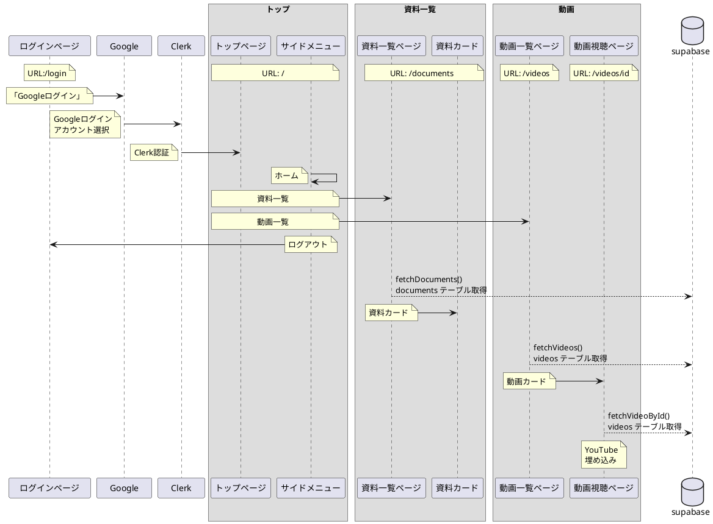
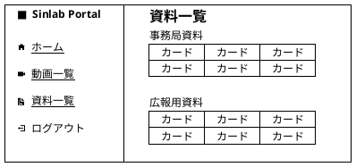
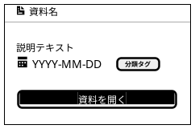
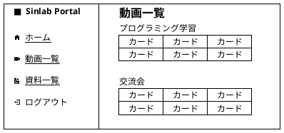
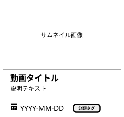
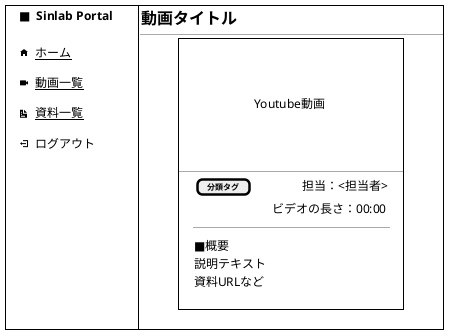

# シンラボポータルサイト機能仕様書

## 1. 概要

### 1.1 目的

シンラボメンバーがサロン内の各種サービスやリソースをより効率的に活用できるよう、サロン機能を段階的に拡充する。メンバーの利便性を向上させ、より快適な学習・活動環境を提供することを目指す。

### 1.2 開発方針

- 段階的な機能拡充
- 各機能は必要最小限の実装からスタート
- ユーザーフィードバックを基に改善・拡張
- 既存システムとの整合性を維持

### 1.3 構成図



## 2. 認証機能

### 2.1 機能概要

Clerkを使用したGoogleアカウントでの認証機能を提供し、ログインしたメンバーの情報をSupabaseのデータベースで管理する。

### 2.2 実装方針

1. 認証基盤

   - Clerkを使用したGoogle OAuth認証
   - ログイン後のセッション管理

2. データ管理

   - 初回ログイン時にSupabaseのusersテーブルにメンバー情報を登録
   - 登録情報：
     - clerk_id（Clerkから発行されるID）
     - email（Googleアカウントのメールアドレス）
     - display_name（Googleアカウントの表示名）
     - role（デフォルト：`member`）
     - status（デフォルト：`pending`）

### 2.3 基本機能

1. ログイン

   - Googleアカウントでのログイン
   - 認証情報の保持

2. ログアウト

   - セッションの破棄
   - ログイン画面への遷移

3. メンバー承認機能

   - 初回ログイン後、承認が行われるまで専用ページにリダイレクトさせる
   - 管理者により承認が行われると、正常にアクセスが可能となる
     - `status`（デフォルト：`pending`）を `active` に変更する
   - 管理者が拒否した場合、`status` を `rejected` に変更する

### 2.3 画面遷移

1. 未ログイン時のアクセス

   - 全ての保護されたルートへのアクセスはログイン画面にリダイレクト
   - ログイン成功後は元のアクセス先へリダイレクト

2. 未承認時のアクセス

   - 全ての保護されたルートへのアクセスは承認待ちの画面にリダイレクト
   - ログアウトボタンクリックでセッション破棄
   - ログイン画面へ遷移

3. 拒否時のアクセス

   - 全ての保護されたルートへのアクセスは、ログアウトした状態で拒否時の画面にリダイレクト
   - 管理者メールアドレスまで個別にご連絡いただくよう案内表示

4. ログアウト時

   - ログアウトボタンクリックでセッション破棄
   - ログイン画面へ遷移

### 2.4 画面表示

1. 未ログイン時の画面

   ```plantuml
   @startsalt
   {+
      　　　 | 　 | 　　　
      　　　 | <U+00A0><size:20><b>シンギュラリティ・ラボ ポータルサイト</b></size> | 　　　
      　　　 | 　 | 　　　
      　　　 | <color:red><b>本サイトには、シンギュラリティ・ラボの会員のみアクセスできます。 | 　　　
      　　　 | 　 | 　　　
      　　　 | { { <size:20>　　　　　 } | [　<size:18><b>G</b></size>　Googleでログイン　] | 　　　<U+00A0> } | 　　　
      　　　 | 　 | 　　　
   }
   @endsalt
   ```

2. 承認待ち画面

   ```plantuml
   @startsalt
   {+
      　　　 | 　 | 　　　
      　　　 | <size:20><b>シンギュラリティ・ラボ ポータルサイト</b></size> | 　　　
      　　　 | 　 | 　　　
      　　　 | 　　　　　　　　※現在、管理者による承認待ちです。 | 　　　
      　　　 | 　　　　　　　承認完了まで今しばらくお待ちください。 | 　　　
      　　　 | 　 | 　　　
      　　　 | { { <size:20>　　　　　　　 } | [　ログアウト　] | 　　　<U+00A0> } | 　　　
      　　　 | 　 | 　　　
   }
   @endsalt
   ```

3. 拒否時の画面

   ```plantuml
   @startsalt
   {+
      　　　 | 　 | 　　　
      　　　 | <size:20><b>シンギュラリティ・ラボ ポータルサイト</b></size> | 　　　
      　　　 | 　 | 　　　
      　　　 | 　　　　　　　　　※承認されませんでした。| 　　　
      　　　 | 　　　　　　　　管理者にお問い合わせください。 | 　　　
      　　　 | 　 | 　　　
      　　　 | { { <size:20>　　　　　　　 } | ~<メールアドレス> | 　　　<U+00A0> } | 　　　
      　　　 | 　 | 　　　
   }
   @endsalt
   ```

## 3. 資料一覧ページ

### 3.1 機能概要

シンラボ内の各種資料（申請フォーム、ドキュメント等）への素早いアクセスを可能にする一覧表示機能を提供する。

### 3.2 基本機能

1. サイドバーからの画面遷移

   - サイドバーに「資料一覧」メニューを追加
   - クリックで資料一覧ページ（`/documents`）に遷移

2. 資料一覧の表示

   - カード形式での表示
   - 1行3カードのグリッドレイアウト
   - レスポンシブ対応（画面幅に応じてカード数を調整）
   - カードは「事務局資料」「広報用資料」などの分類別に表示

3. 資料の閲覧
   - カード内の「開く」ボタンをクリック
   - 新タブでGoogleドライブの該当資料を表示

### 3.3 表示項目

各カードには以下の情報を表示：

- 資料名
- 分類タグ
- 説明文（100文字程度）
- 更新日
- 「開く」ボタン

### 3.4 画面レイアウト



### 3.5 カードデザイン



## 4. 動画一覧ページ

### 4.1 機能概要

シンラボの動画コンテンツ（プログラミング学習、交流会等）の一覧表示機能と再生機能を提供する。

### 4.2 基本機能

1. サイドバーからの画面遷移

   - サイドバーに「動画一覧」メニューを追加
   - クリックで動画一覧ページ（`/videos`）に遷移

2. 動画一覧の表示

   - カード形式での表示
   - 1行3カードのグリッドレイアウト
   - レスポンシブ対応（画面幅に応じてカード数を調整）
   - カードは「プログラミング学習」「交流会」などの分類別に表示
   - カード上部にサムネイル画像を表示

3. 動画の再生
   - カードをクリック
   - 該当動画のYouTube再生画面ページ（`/videos/id`）に遷移

### 4.3 表示項目

各カードには以下の情報を表示：

- 動画名
- 分類タグ
- 説明文（100文字程度）
- 更新日

### 4.4 画面レイアウト



### 4.5 カードデザイン



## 5. 動画再生ページ

### 5.1 機能概要

シンラボの動画コンテンツ（プログラミング学習、交流会など）の再生機能、動画情報を提供する。

### 5.2 基本機能

1. 動画再生ページの表示

   - Youtube動画は埋め込み形式とする
   - 1ページ1動画で表示する
   - レスポンシブ対応 (画面幅に応じて、動画表示領域を調整する)
   - 動画タイトルは動画の上に表示する

2. 動画の再生

   - Youtube動画表示領域にて再生ボタンを押す
   - 動画の再生

### 5.3 表示項目

動画表示ページには以下の情報を表示

- 動画名
- 分類タグ
- 担当者（情報がある場合のみ）
- ビデオの長さ（情報がある場合のみ）
- 説明文（100文字程度）  
  説明文中の改行コードは改行に変換する  
  説明文中のURLはリンクに変更する

### 5.4 画面レイアウト



## 6. 今後の機能拡充予定

※ 今後、以下のような機能追加を検討する際は、本章以降に各機能の詳細仕様を追加していく。

- メンバー承認画面の実装
- その他、メンバーからの要望に基づく機能
